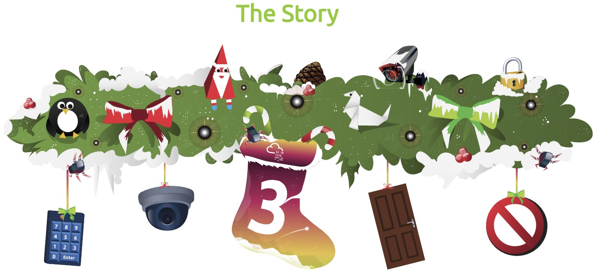
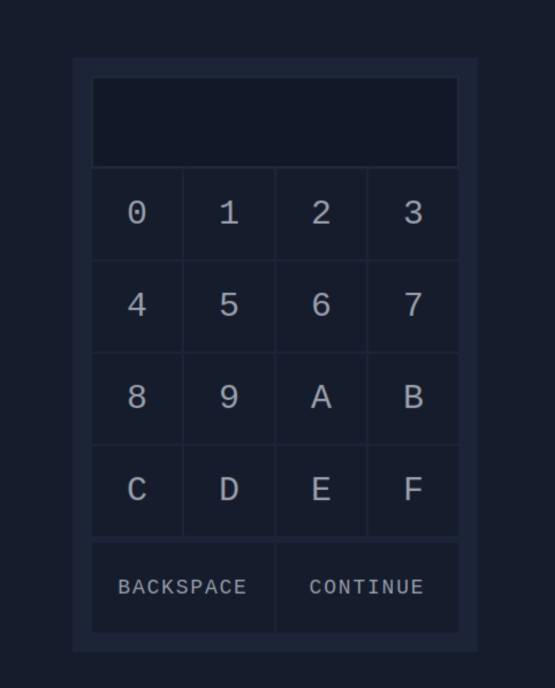
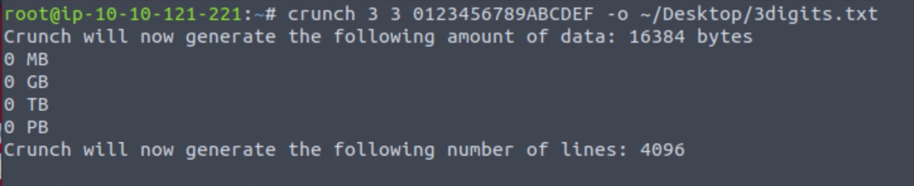
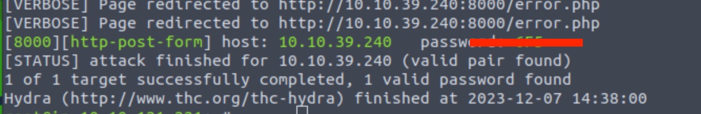

<h1>🎅🏻Ho! 🎅🏻Ho! 🎅🏻Ho! 

Welcome to Advent of Cyber 2023</h1>

<h2>[Day 3] Brute-forcing Hydra is Coming to Town</h2>

So today we will have some fun with Hydra. 
By the way the famous Hydra that Hercules in one of his labours needed to kill is not to far away from where I grew up in Greece ;) 

There is only one question in the challenge so it might be really simple to find it out.

## Step 1. 

After you have started the AttackBox and VM for this challenge, you will have to wait for 2-3 minutes.
Next you should open firefox - *or your dedicated browser if you are using your own VM* - and open the IP address of the VM.

You will see this:

If you follow the instructions from the TryHackMe page, you must create the password list with Crunch.
We need to do this because Hydra uses word lists to crack the passwords.

You can type the following command (I saved the file on the desktop to make my life easier)

`crunch 3 3 0123456789ABCDEF -o ~/Desktop/3digits.txt`

## Step 2.

Now we are going to use Hydra.

Hydra will run on the background applying all the combinations in from our list until it finds the correct one.

You should use this command:

`hydra -l '' -P ~/Desktop/3digits.txt -f -v 10.10.39.240 http-post-form "/login.php:pin=^PASS^:Access denied" -s 8000`

Now we have to wait for sometime ...

After some more time...

Now use the code and you can find the flag!

# Until the next time! 🎅🏿🎅🏿🎅🏿
