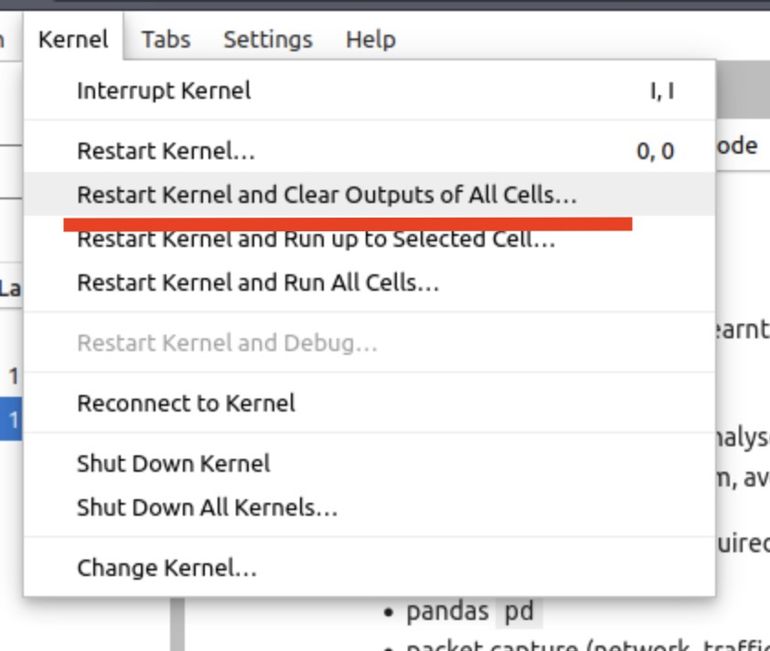
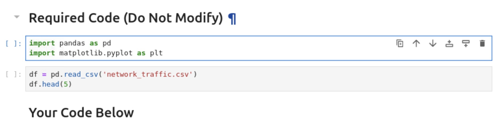
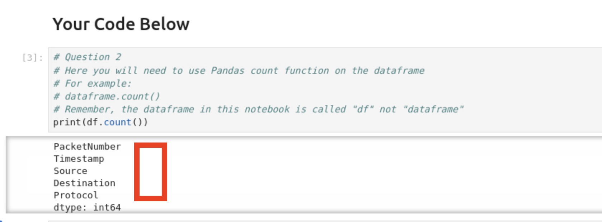
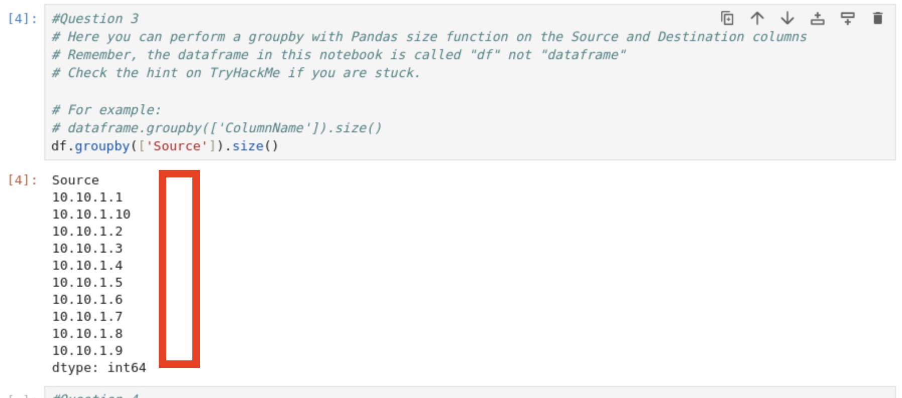
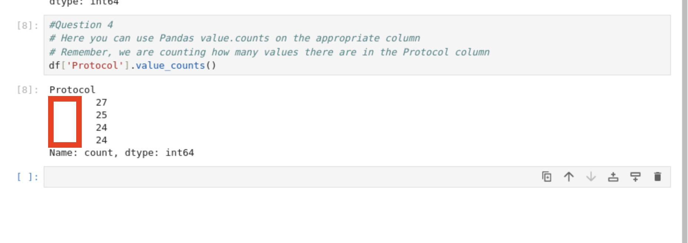

<h1>🎅🏻Ho! 🎅🏻Ho! 🎅🏻Ho! 

Welcome to Advent of Cyber 2023</h1>

<h2>[Day 2] Log analysis O Data, All Ye Faithful</h2>

Let us jump directly to the answers!

First of all we need to *open* the Jupyter File.
Double click on the left panel the file `Workbook.ipynb`.

Next is better to clear all the kernel code that might have been executed earlier...

Kernel --> Restart Kernel and Clear Outputs of All Cells...

## Question 1: How many packets were captured (looking at the PacketNumber)?
*Hint: You can use the count() function. Remember, the DataFrame that contains the packet capture is called "df".*

Before you get the answer you need to run the required code 

Next step is to follow the hint inside the Jupyter Notebook. We just need to do add this code:

`print(df.count())`

Success!

## Question 2: What IP address sent the most amount of traffic during the packet capture?

*Hint: The name of the column you need to use the size() function on is called "Source".*

We just need to type `df.groupby(['Source']).size()`

And again Success!

## Question 3: What was the most frequent protocol?

*Hint:You can use the value.counts function on the DataFrame. Remember, the name of the column that contains the Protocol in the packet capture is called "Protocol". Your command will look like: df['ColumnHere'].value_counts()*

We just need to type `df['Protocol'].value_counts()`

And we are done!

# Until the next time!

