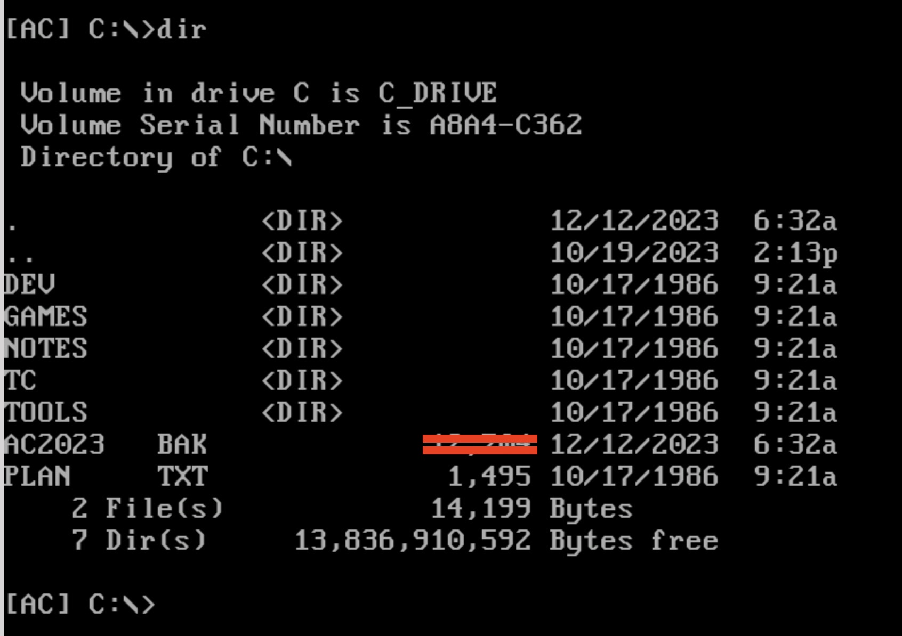
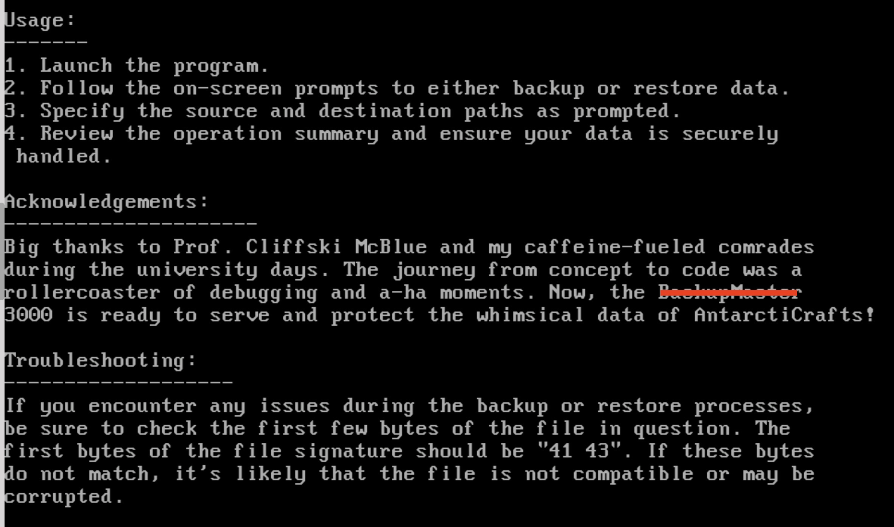
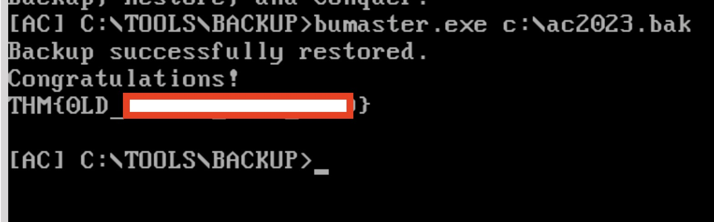

<h1>🎅🏻Ho! 🎅🏻Ho! 🎅🏻Ho! 
Welcome to Advent of Cyber 2023</h1>

<h2>[Day 5] Reverse engineering A Christmas DOScovery: Tapes of Yule-tide Past</h2>

## Question 1: How large (in bytes) is the AC2023.BAK file?

This is a really simple question. You will need to navigate to Drive C:\ using the command:

`CD..`

When you are there just use the command `DIR` and then you can find the answer.

## Question 2: What is the name of the backup program?

*Hint: Check README.TXT*

Although you might think the name is BUMASTER.EXE *as I did* :). I think we should just follow the hint instructions.

If you are in directory C:\ from the previous question you need to navigate to the directory tha the Back Up application is located to find the README.TXT so:

`CD TOOLS` and then `CD BACKUP`

Now you should be in the directory C:\TOOLS\BACKUP>

Using the command `TYPE README.TXT` we can read the contents of the file.

You will find the name of the application in the Acknowledgements. *Extra Hint: Also the number is important!*

## Question 3: What should the correct bytes be in the backup's file signature to restore the backup properly?

For this question just read inside Troubleshooting in the README.TXT it is really obvious what these numbers are...

## Question 4: What is the flag after restoring the backup successfully?

*Use the “EDIT” command to change the first two bytes of the backup file.*

We need to follow the steps of Back to the past. Follow the commands below:

1. `CD ..` and again `CD ..`
2. Now you should be at the root directory `C:\>`
3. `EDIT C:\AC2023.BAK`
4. CHANGE THE 2 topmost characters from XX --> AC  Is the converted values of 41 43 to ASCI()
5. Navigate back to the directory of BackUpMaster3000. `CD TOOLS` and `CD BACKUP`
6. Use the Command `BUMASTER.EXE C:\AC2023.BAK`
7. Success!

# Until the next time! 🎅🏿🎅🏿🎅🏿