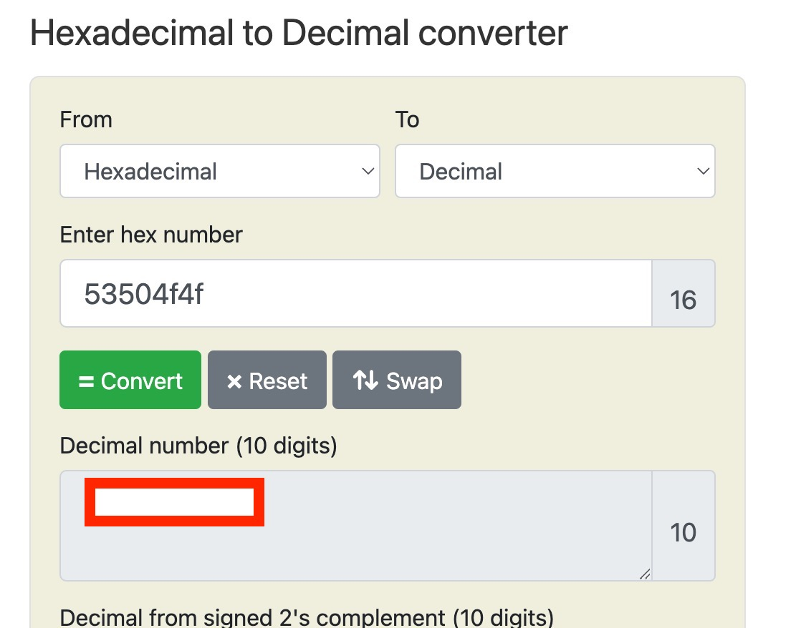
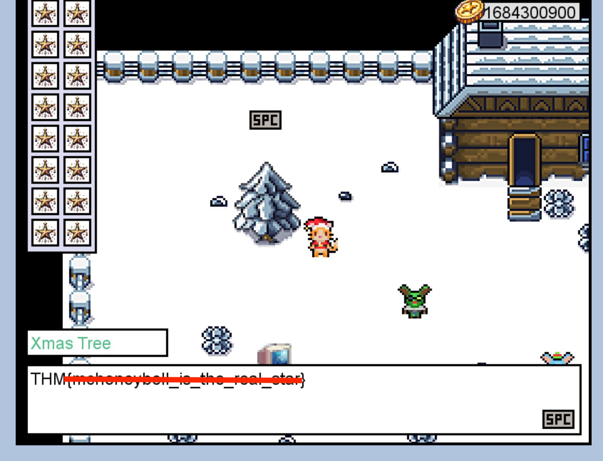

<h1>🎅🏻Ho! 🎅🏻Ho! 🎅🏻Ho! 

Welcome to Advent of Cyber 2023</h1>

<h2>[Day 6] Memory corruption Memories of Christmas Past</h2>

Well although it is a silly game, it explains in a really simple way what memory corruption is!

## Question 1: If the coins variable had the in-memory value in the image below, how many coins would you have in the game?

First of all you must find a Hex to decimal converter this is a good one [Hex-to_Decimal](https://www.rapidtables.com/convert/number/hex-to-decimal.html)

Then you have to input the values we need to type the HEX values starting from the last one!

## Question 2: What is the value of the final flag?
*Have you figured out how the INVENTORY works yet? Check the memory layout for anything related!*

So the memory is not so well protected and the easiest way to get a start and finish the game is by just changing our name until we have a `d` inside the allocated memory for the inventory area. Then you can go to the tree and place the star on top and finish the game. *You will have to close the pop up window and the flag will be on the text box!*

My name change input was just `ddddddddddddddddddddddddddddddddddddddddddddddddd`

# Until the next time! 🎅🏿🎅🏿🎅🏿