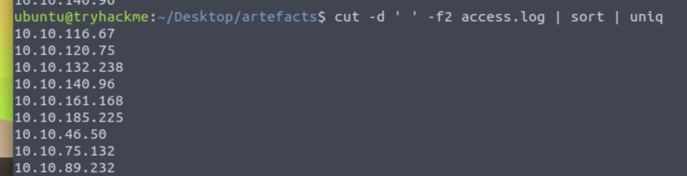
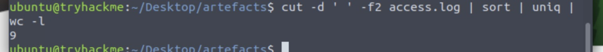
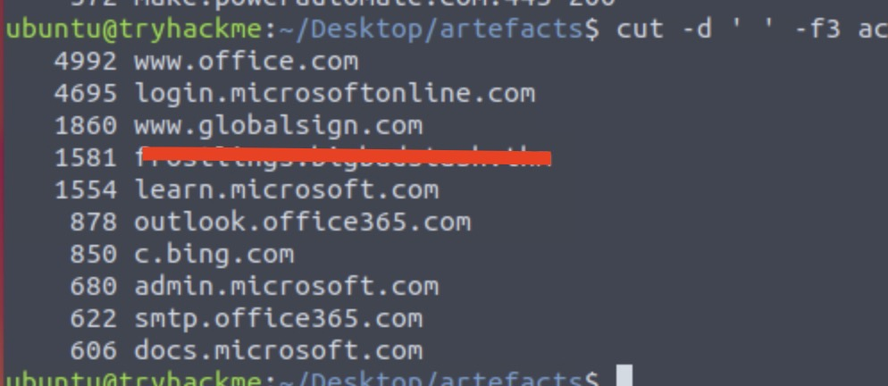

<h1>🎅🏻Ho! 🎅🏻Ho! 🎅🏻Ho! 

Welcome to Advent of Cyber 2023</h1>

<h2> [Day 7] Log analysis ‘Tis the season for log chopping!</h2>

So today we will some basic log analysis, fun times :| 

The Challenge does a really good job explaining how the basic commands of a Unix clone system terminal work. If you are not familiar with Linux / MacOs terminal commands I suggest that you take a look.

So this challenge needs more work to find the answers. Will try to explain my way of thinking as much as possible.

## Question 1: How many unique IP addresses are connected to the proxy server?

So if we take a look in the table of contents for the proxy log we can see that the Source IP is at the 2nd position.

So let us start building the command we have to use to find the unique IP's.

We begin of course with the cut command and the cut will be the white space we will also `' '` as delimiter .

`cut -d ' '`

As the position of the IPs is 2 the command now becomes 

`cut -d ' ' -f2`

and we finally add the file we need to check.

`cut -d ' ' -f2 access.log`

This command will get us some thousands results back so we must use shorten it somehow.The best thing to do is use the `uniq` command. In order to use the `uniq` command we must first sort out the list of IPs using the command `sort`. Now our command is

`cut -d ' ' -f2 access.log | sort | uniq` 

We can now count the unique IP's but you can also use one more command to do the job for you `wc -l` so:

`cut -d ' ' -f2 access.log | sort | uniq | wc -l` 

## Question 2: How many unique domains were accessed by all workstations?

Now we can use almost the same command but we will cut out position 3(Domain and Port). 

But we also need to remove the ports that we connect to each domain. (Some times we connect to the same domain with a different port and this will count as unique connection if we do not cut the port out)

If we use this command `cut -d ' ' -f3 access.log | sort | uniq | wc -l`, we get a total of 118. It is not correct because as I mentioned we did not cut out the ports.

So after the 1st cut we will add another `cut -d` with delimiter `':'` and position `-f1`.(The new list we created from the previous cut has only 1 item in the 1st position)

`cut -d ' ' -f3 access.log | cut -d ':' -f1 | sort | uniq | wc -l`

Now you will get the correct count. 

## Question 3: What status code is generated by the HTTP requests to the least accessed domain?

First we need to find the list accessed domain. We will use the command that is used to explain linux pipes. 

`cut -d ' ' -f3 access.log | cut -d ':' -f1 | sort | uniq -c | sort -n | head`

With this command we will get an ascending list of the domains accessed.

Using the first domain on the list you can then use the `grep` command to find out the answer

`grep **REDACTED** access.log | head`

Of course you can use pipes and cut out what you need but some times simpler is better

## Question 4: Based on the high count of connection attempts, what is the name of the suspicious domain?

So now we just use again the previous command but reversing the order of the return list. 
The command is:

`cut -d ' ' -f3 access.log | cut -d ':' -f1 | sort | uniq -c | sort -nr| head`

You will see a suspicious domain name...

## Question 4:What is the source IP of the workstation that accessed the malicious domain?

Again the simplest and fastest way is using the domain name with grep. 

`grep **REDACTED** access.log | head`

## Question 5:How many requests were made on the malicious domain in total?

Use `cut -d ' ' -f3 access.log | cut -d ':' -f1 | sort | uniq -c | sort -nr| head` the answer is there on the left...

## Question 6: Having retrieved the exfiltrated data, what is the hidden flag?

We will just use the command already provided by THM.

`grep **SUSPICIOUS DOMAIN** access.log | cut -d ' ' -f5 | cut -d '=' -f2 | base64 -d`

Just read the returned values *starting from the button going up* and you will see it after 20-30 lines...

# Until the next time! 🎅🏿🎅🏿🎅🏿