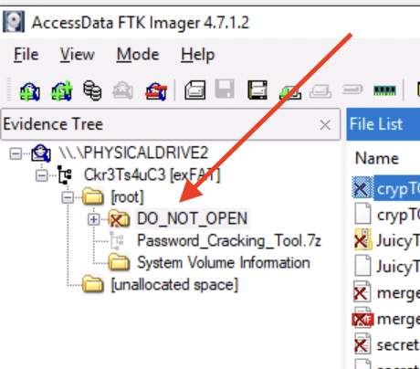
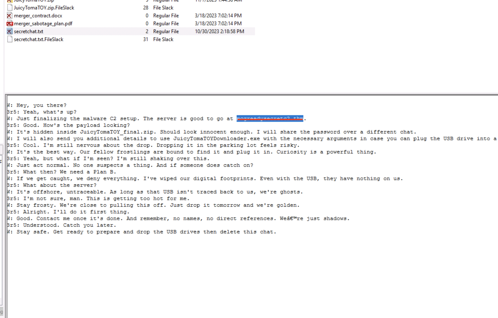
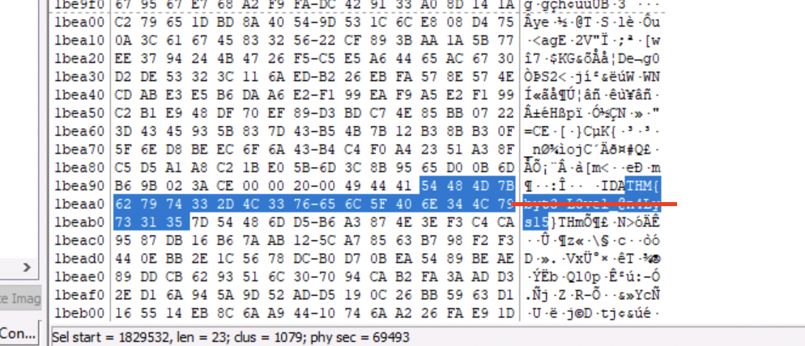
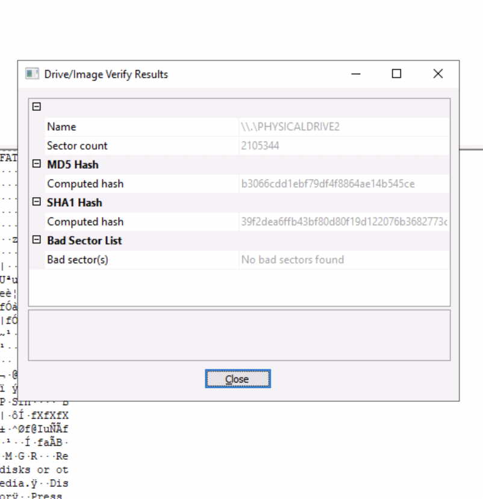

<h1>🎅🏻Ho! 🎅🏻Ho! 🎅🏻Ho! 

Welcome to Advent of Cyber 2023</h1>

<h2>[Day 8] Disk forensics Have a Holly, Jolly Byte!</h2>

Let us jump into it!

## Question 1: What is the malware C2 server?
*Hint: Look into the deleted .txt file inside the deleted folder.*

Following the simple instructions we will import the device as an evidence and then click root...

Of course when we see a folder saying DO_NOT_OPEN what is the first thing we are going to do but OPEN IT!!!!

Then of course we will open the secretchat.txt and following the conversation we can find the name of the server.

## Question 2: What is the file inside the deleted zip archive?

Just click on the zip file and use the name of the only file you see inside!

## Question 3: What flag is hidden in one of the deleted PNG files?
*Hint: Consider clicking "Ctrl + F" to search for "THM{" while in Hex preview mode.}*

So following the instructions of the hint it is really easy to find the answer!
*Tip: Check the portrait.png file*

## Question 4: What is the SHA1 hash of the physical drive and forensic image?

We will just use the File > Verify Drive/Image command to find the hash!

# Until the next time! 🎅🏿🎅🏿🎅🏿