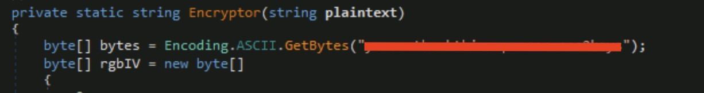
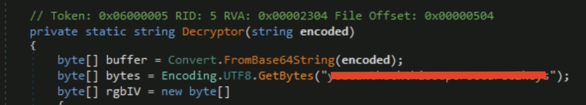

<h1>🎅🏻Ho! 🎅🏻Ho! 🎅🏻Ho! 
Welcome to Advent of Cyber 2023</h1>

<h2>[Day 9] Malware analysis She sells C# shells by the C2shore</h2>

## Question 1: What HTTP User-Agent was used by the malware for its connection requests to the C2 server?
*Review the functions used to initiate an HTTP request.*

Following the instructions for GetIt we can find out the UserAgent. Just need to either scroll down until line 215 or, click on GetIt at line 30 that will take you where the UserAgent is located!

## Question 2: What is the HTTP method used to submit the command execution output?

This question is not really hard even if you do not follow any of the information provided by the challenge.

Just think what are the main methods of HTTP "GET", "P***", "PUT", "DELETE", etc.

## Question 3: What key is used by the malware to encrypt or decrypt the C2 data?

You can find the key in either the Encryptor or Decryptor methods. 

## Question 4: What is the first HTTP URL used by the malware?

You can see that the URL is a concatenation of 2 items the str and something more... 

## Question 5: How many seconds is the hardcoded value used by the sleep function?
*Remember that the value passed to the Sleep function is using milliseconds.*

You can see that the program Sleeper gets as an argument count. The variable int count have a large number. The hint gives you a tip how to calculate it.

## Question 6: What is the C2 command the attacker uses to execute commands via cmd.exe?

Now, for this one you must have some basic knowledge of how Windows Shell works. Just to help you a bit check the lines 43-51 you can see some *shell* commands...

## Question 7: What is the domain used by the malware to download another binary?

Check the domain in Program.Implant but take away the http:// and /spykit.exe.

# Until the next time! 🎅🏿🎅🏿🎅🏿