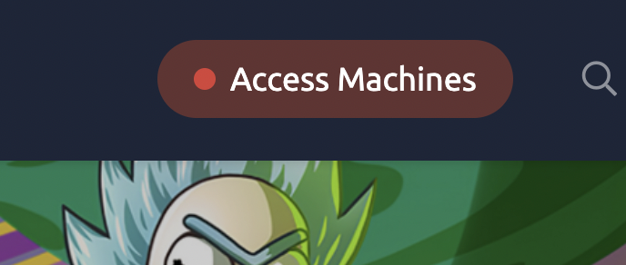
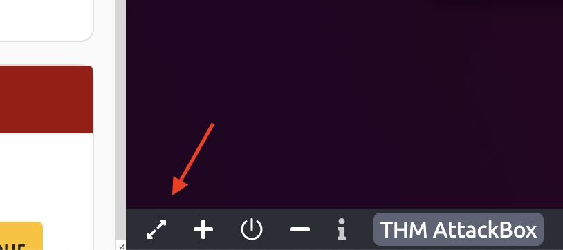
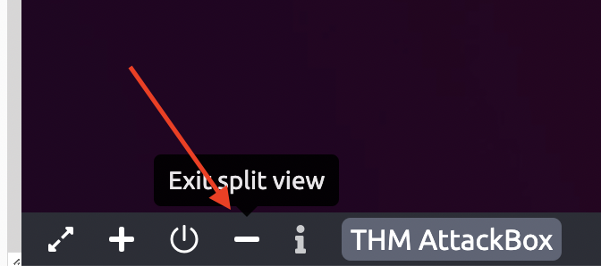
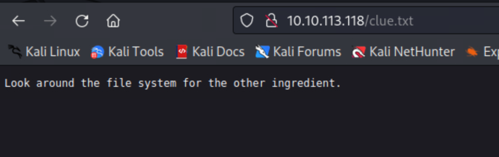

# About 
This is one of the simple CTF based on the Rick and Morty cartoon. This is a **free**room, which means anyone can deploy virtual machines in the room (without being subscribed)!
There are only 3 questions so probably not to hard to bit!

# Start here.

## Step 1 

Before we begin of course we need to start the VM that Rick has stored the ingredients!

## Step 2 

Also, after this click on *Start Attack Box*. Of course you can use your own computer but then you must first connect through the OpenVpn.

You  can find more information how to do it by clicking the *Access Machines*!

If you are using the *Attack Box* it is a good idea to use Split Screen to make your life easier!

## Step 3

Click on the *View in full Screen* at the bottom of the VM screen

A new tab with the VM will pop-up.

## Step 4

Now you can close the Split View on the original window by clicking on the Split View at the bottom of the VM screen.

Now you can use 2 tabs for the challenge, if you have 2 screens you can make your live easier with this trick!

*While I was completing this challenge the AttackBox was having some issues, so I moved to the Kali Linux Box. If you have issues after Firefox opens the VM address better close the AttackBox and move to Kali Linux Box*

After all these are  done is time for our 1st Challenge! 

# Question 1

  
**What is the first ingredient that Rick needs?**

## Step 1.1
Let us start with the easy part first.
On your machine or on the VM from TryHackMe [[#Step 2]] open your web browser of choice (Firefox for the VM). 
On the address bar type the address of the VM you started earlier [[#Step 1]].
  

For my example I had this IP: 10.10.149.123   

Web Browser of local VM

## Step 1.2

After this is always a god idea to inspect the source code of the web page 
[Go to Source Code Inspection Help](#Source-Code-Inspection)

When you inspect  the code you can see someone wrote the username so they will not forget, should be also nice to leave the Password there!

Also, if you check the header of the HTML code we can see that there might be more directories in the same server that we can reach.  
These directories might have something important hidden there, or gives us some more clues about finding the answers we seek.

Now our next step will be to check if there are more directories!

## Step 1.3

Now in order to find if there are more directories linked to the one we just visited we can use a tool that is using wordlists to find any hidden web pages linked to this IP(Server)
There several tools that can do that like [gobuster](https://www.kali.org/tools/gobuster/) or [dirbuster](https://www.kali.org/tools/dirbuster/)

In the VM of the AttackBox gobuster is already installed and we can use it.
gobuster is not really easy to use so if you can ask the help of chatGPT you should.

I will add the command you should use and I will try to explain how it works.

The command is the following:

`gobuster dir -u http://10.10.116.1 -w /usr/share/wordlists/dirbuster/directory-list-2.3-medium.txt -x php,txt,zip,html` 

The `gobuster dir -u http://10.10.116.1` specifies to gobuster the server that has to be brute-forced in order to find the available directories

The `-w /usr/share/wordlists/dirbuster/directory-list-2.3-medium.txt`  specifies the wordlist gobuster is going to use.

The `-x php,txt,zip,html` specifies what file extensions is going to check for.

The result of the command is this:

As you can see the gobuster found a lot of extra hidden directories that we can reach by adding them after the servers ip.   
*The directories with Status: 200 are available to see without any password...*

Let's go check them out!   
### login.php

 We need the logins to find more! 

### robots.txt

There is some text here, maybe this is the password to log us in the login page?

### clue.txt

Maybe this is a clue that we can use this later.

## Step 1.4
Now we are going to use the Username we found in [Step 1.2](#step-12) and the word we found on [Step 1.3](#step-13)

Success!!! 

A new webpage is revealed.

Checking the links doesn't reveal anything  just  this image:

Also inspecting the code is not giving us any clues, maybe later we can find something more.

## Step 1.5
BUT! 
Usually the servers are hosted by linux systems so lets try some linux commands.

Using the `ls` command in the command panel we get this response:

Maybe will be a good idea to try these names as directories/web pages that might contain a clue!!!

## Step 1.6
We already know what robots.txt does.
If we try Sup3rS3cretPickl3Ingred.txt we are faced with this page:

![[Screenshot 2023-09-21 at 18.37.53.png]]
If we use the clue we can answer the  1st Question:  *What is the first ingredient that Rick needs?*

**Congratulations!!!** 

# Question 2

## Step 2.1
At [[#Step 1.5]] we used the `ls` command, let us use the pwd and whoami commands now.

`pwd`: 

![[Screenshot 2023-09-21 at 18.43.02.png]]

and `whoami`:

![[Screenshot 2023-09-21 at 18.43.32.png]]

Both commands are really good to understand what are the possibilities to find more clues about the ingredients. Maybe we should start searching in the system as the [[#clue.txt]] suggested 

## Step 2.2

Using the `ls /home command` we see that are 2 directories for users rick and ubuntu... 

![[Screenshot 2023-09-21 at 18.46.08.png]]

## Step 2.3
Using the command `ls /home/rick` we see there is a file inside users rick directory maybe we should try to see what is inside this file with the `cat` command

![[Screenshot 2023-09-21 at 18.47.47.png]]

## Step 2.4 
Using the `cat /home/rick/second ingredients` 
Unfortunately Rick is smart!!!

![[Screenshot 2023-09-21 at 18.52.31.png]]

## Step 2.5 
Maybe Rick is smart but we know linux...  Let's try some more commands like `sudo cat /home/rick/second ingredients `

![[Screenshot 2023-09-21 at 18.52.31.png]]

Again the same but we know there are more types of commands to use with especially now that we saw that `sudo` commands are available!

## Step 2.6
Another useful command is `sudo less` 
The only catch is that this command needs to be executed as following:
`sudo less "/home/rick/second ingredients"`
It is a bit complicated to explain what the command `less` is doing so better read the documentation.

After we run the command we have something new:

![[Screenshot 2023-09-21 at 20.13.53.png]]`

**Congratulations!!** 
# Question 3

## Step 3.1

Another really nice command to check all the directories in the current user is `sudo ls ../../../*`

![[Screenshot 2023-09-21 at 19.57.08.png]]

We get  a lot of directories, if we search more inside them we see 
![[Screenshot 2023-09-21 at 19.59.19.png]]
**Bingo**

Lets try to see what is inside:

![[Screenshot 2023-09-21 at 20.17.30.png]]

**Congratulations!! You found the last ingredient, Rick is saved!!!** 

Hope you had enjoyed this guide, if you want to comment or correct me please feel free to contact me. 

# Source Code Inspection

### Google Chrome:

1. **Right-Click Method:**
	- Right-click on a part of the webpage (avoiding any images or media).
	- Select "View Page Source" from the context menu.
1. **Keyboard Shortcut:**
	- Press `Ctrl + U` (Windows/Linux) or `Cmd + Option + U` (Mac).
1. **Menu Method:**
	 - Click on the three vertical dots (⋮) located at the top-right corner to open the Chrome menu.
	 - Navigate to "More tools" > "Developer tools", or just press `Ctrl + Shift + I` (Windows/Linux) or `Cmd + Option + I` (Mac).

### Mozilla Firefox:

1. **Right-Click Method:**
    - Right-click on a part of the webpage.
    - Select "View Page Source" from the context menu.
2. **Keyboard Shortcut:**
    - Press `Ctrl + U` (Windows/Linux) or `Cmd + U` (Mac).
3. **Menu Method:**
    - Click on the three horizontal lines (≡) located at the top-right corner to open the Firefox menu.
    - Click "Web Developer" and then "Page Source".

### Microsoft Edge:

1. **Right-Click Method:**
    - Right-click on a part of the webpage.
    - Select "View page source" from the context menu.
2. **Keyboard Shortcut:**
    - Press `Ctrl + U`.

### Safari:

1. **Menu Method:**
    - First, you need to enable the Develop menu:
        - Go to Safari > Preferences > Advanced.
        - Check the box at the bottom where it says "Show Develop menu in menu bar".
    - Once the Develop menu is enabled, you can select any page and then click "Develop" > "Show Page Source".
2. **Keyboard Shortcut:**
    - With the Develop menu enabled, you can also press `Cmd + Option + U`.
