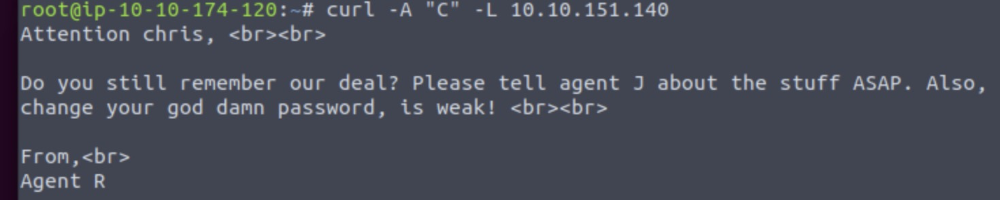

<h1>Welcome to another Walk Through.</h1>

Just as per usual will try to be as simple as possible with the instructions.

# Task 1: Author note
Just Deploy the machine and you are done.

# Task 2: Enumerate

## How many open ports?
*Hint*: nmap

As you can see there are 3 ports open: 21,22 and 80.

## How you redirect yourself to a secret page?
*Hint*: Answer format: xxxx-xxxxx

We will try ot connect to the server with a web-browser as we can see that port 80 (tcp) hosts an Apache server

It is giving as a lot of information this web page and, of course the answer for our question that is the `user-agent` 

## What is the agent name?
*Hint*:You might face problem on using Firefox. Try 'user agent switcher' plugin with user agent: C

It is easier to use curl instead of Firefox.

One of the Secrete agent names is "R".

So let's try to use this codename to see what we can find. We will use the `curl -A "R" -L 10.10.151.140` command to get the information we need.

Some basic information about the command:
`-A "C"`: This option sets the User-Agent string to "C". The User-Agent string is a part of the HTTP header sent in a network request that identifies the type or version of software and operating system used by the client (browser or other HTTP clients). By setting it to "C", it is likely attempting to mimic or simplify the identification of the client to the server.

`-L`: This option tells curl to follow redirects. If the server responds with a location header (indicating that the resource has been moved or redirected), curl will make a new request to the location provided in the header.

**Success**, now we know that are 25 agents so we can search with the rest of the Alphabet letters to see what we can find.

Finally with letter "C" we get a different reply:

We found the agent name `chris`.

# Task 3: Hash cracking and brute-force

## FTP password
*Hint*: Hail hydra!

Let's follow the hint and use Hydra to break the weak password of chris.

We can try either FTP or SSH. Let us try 1st the FTP.

This is the command we are going to use `hydra -l chris -P '/root/Desktop/Tools/wordlists/rockyou.txt' ftp://10.10.151.140`

**Success** we found the password: `crystal`

We logged in the FTP server with the credentials and we grabbed the files there were inside just in case.

## Zip file password
*Hint*: Mr.John

What zip file? Maybe we can find some information inside the files we downloaded.

Hmm, interesting. So lets use some steganography to check what is hidden inside the images.
The tool we are going to use is binwalk with the following command `binwalk cutie.png`

We can clearly see one zip file named `0x8702`. Now we should extract the files with the command `binwalk -e cutie.png`

You can see the directory `_cutie.png.extracted`, and inside files `365, 365.zlib, 8702.zip, To_agentR.txt`. 
Of course the 8702.zip is encrypted and we must use a password to decrypt it, or maybe we can use Mr John to help us.

`zip2john 8702.zip > john.zip`

Now that we have a cracked .zip file we will use again Mr.John to find the password.
The command will be `john john.zip`.

And the password is `alien`.

## steg password

Now the next step is to unzip the file. You can use the command `7z x 8702.zip` and then when prompted enter the password.

Now there is a new `To_agentR.txt` file that we can finally open.

Hmmm `QXJlYTUx` looks like Base64... Let's use Cyberchef.

So the password is `Area51`.

## Who is the other agent (in full name)?

Now we will try to extract the information form the other image with the command `steghide extract -sf cute-alien.jpg`.

Opening the `message.txt` we find out the name of the agent `james` and his password `hackerrules!`.

## SSH password

`hackerrules!`

# Capture the user flag

## What is the user flag?

Now things are getting easier. We can use the user name and the password that we found on the previous question.

`ssh james@10.10.151.140` `password:hackerrules!`

**Success** we can see a txt file named `user_flag.txt` using the `cat user_flag.txt` we get the following flag.

`b03d975e8c92a7c04146cfa7a5a313c7`

## What is the incident of the photo called?
*Hint*: Reverse image and Foxnews.

Let us download the other file the user has, `Alien_autospy.jpg` and check it. 

We will use secure copy over ssh with the command `scp james@10.10.151.140:/home/james/Alien_autospy.jpg ~/Desktop`. 

If we search the internet, for the picture Alien autopsy, we eventually find out it is about the `Roswell Alien Autopsy` that is also the answer.

# Privilege escalation

## CVE number for the escalation (Format: CVE-xxxx-xxxx)

As you can see we are not able to enter the root character in order to find the flag key. But, we might be able to find a CVE to exploit.

Let see what operations user James can execute using the command ` sudo -l`.

We see inforamtion about `(ALL, !root) /bin/bash`. After a quick search we get this result.

So the exploit is `CVE:2019-14287`

If you check inside the file you will find the command that lets you exploit the vulnerability.

`sudo -u#-1 /bin/bash`

## What is the root flag?

Executing the command `sudo -u#-1 /bin/bash`, we finally login as root.

Let us find out now the flag.

`b53a02f55b57d4439e3341834d70c062`. 

## (Bonus) Who is Agent R?

From the previous hack we can find the name of Agent R: `DesKel`

<H1>The End</H1>

Thank you for following this walk through. If you have any comments please feel free to contact me.
