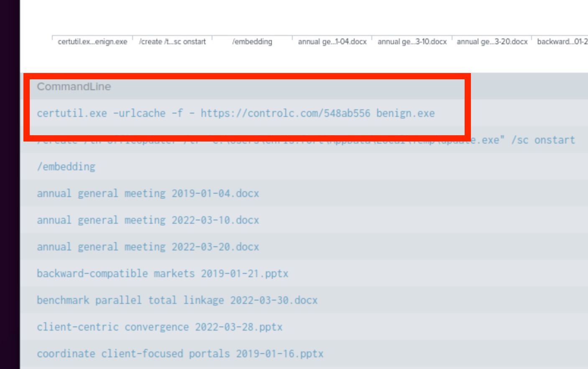

<h1>About</h1>

Welcome to another one of my walkthroughs. 

Before you start this CTF is good to have finished the rooms  [splunk101](https://tryhackme.com/room/splunk101) and [splunk201](https://tryhackme.com/room/splunk201).

# Start Here

You first need to start the VM machine that is hosting Splunk and,  

if you are using the VM that are provided by TryHackMe.

Also for your own convenience you can use a separate tab for the AttackBox by doing the following:

1. Click on the View in full screen at the bottom left of the AttackBox screen.

2. Now a new tab will open with the VM and you can close the split screen by clicking on exit split view. You now have 2 tabs one with the questions and one with the VM.
    

3. Next step is to use as filter the win_eventlogs with the command `index=win_eventlogs`. Change the time range for now to `All time`and the mode to `Verbose Mode`.

# Task 2, Scenario: Identify and Investigate an Infected Host

### How many logs are ingested from the month of March, 2022?

We need to change the time range for March of 2022:

Then just use the total number of events.

### Imposter Alert: There seems to be an imposter account observed in the logs, what is the name of that user?

This is not so hard to find.

First of all we will find the username on the left panel.
When we click on it we see 10 only names but as you can see the total number of users is 11. 
We can click on the Top Values and a new report will be created.

Now we open the Statistics Tab and we can see all the names. You can see that one more name is at the end of the list a bit different than the correct one. `Amelia VS Amel1a`

### Which user from the HR department was observed to be running scheduled tasks?

The scheduled tasks on Windows are using the `schtasks.exe` so if we use it in the filter we get 4 usernames as results. Only one is from HR

### Which user from the HR department executed a system process (LOLBIN) to download a payload from a file-sharing host.

Now we will use the filter to check all the users from HR what process are running.

We Click on the CommandLine and then on Rare Values.

Now we can see a Certutil.exe is one of the binaries we can find also in the Repository we get as a tip.

Now we can use the name of this executable to see who and when this event happened.

### To bypass the security controls, which system process (lolbin) was used to download a payload from the internet?

We already know the name from the previous steps.

### What was the date that this binary was executed by the infected host? format (YYYY-MM-DD)

We can find the date from the time this one event was created.

### Which third-party site was accessed to download the malicious payload?

Again we can find the information by the details of the event.

### What is the name of the file that was saved on the host machine from the C2 server during the post-exploitation phase?

Yes you guessed it correct ... you can find the information in the details of the event.

### The suspicious file downloaded from the C2 server contained malicious content with the pattern THM{..........}; what is that pattern?

Let's connect to the download server and find out. You can also find the answer to the last question in the same image.

 
### What is the URL that the infected host connected to?

See the previous image.

<h2>This is the end of another CTF, hope you enjoyed it and if you have any comments please feel free to contact me.</h2>