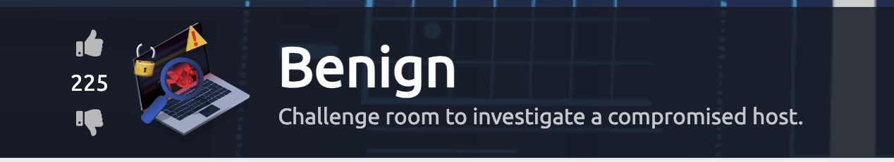

<h1>About</h1>

Welcome to another one of my walkthroughs. 

Before you start this CTF is good to have finished the rooms  [splunk101](https://tryhackme.com/room/splunk101) and [splunk201](https://tryhackme.com/room/splunk201).

# Start Here

You first need to start the VM machine that is hosting Splunk and,  

if you are using the VM that are provided by TryHackMe.

Also for your own convenience you can use a separate tab for the AttackBox by doing the following:

1. Click on the View in full screen at the bottom left of the AttackBox screen.

2. Now a new tab will open with the VM and you can close the split screen by clicking on exit split view. You now have 2 tabs one with the questions and one with the VM.
    

# Task 2, Scenario: Identify and Investigate an Infected Host
