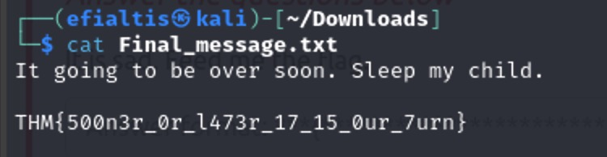
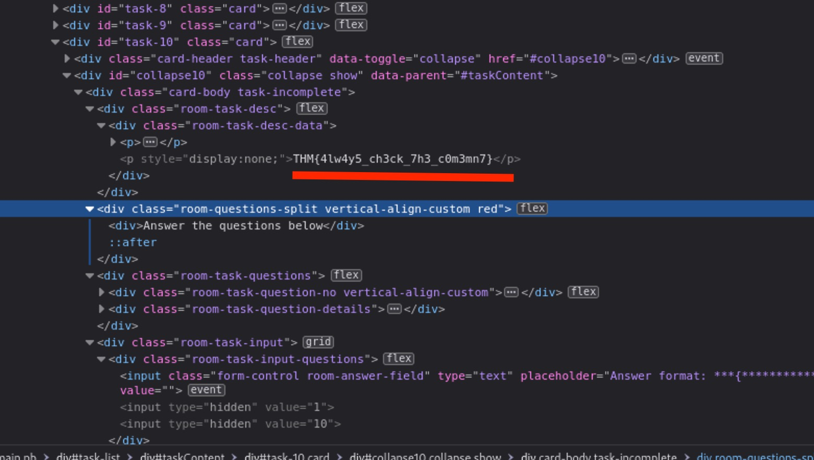

<h1>CTF collection Vol.1 Walkthrough</h1>


Just as per usual will try to be as simple as possible with the instructions.


# Task 1: Author note

Some basic information about the room by the author.

# Task 2: What does the base said?
*Hint: Base64*

Can you decode the following?

VEhNe2p1NTdfZDNjMGQzXzdoM19iNDUzfQ== 

As you can see the cipher we need to decode finishes with two equal signs (==) this is a good indicator that the cipher is coded in Base64. Using a basic online tool like [Cyber Chef](https://gchq.github.io/CyberChef/), will help you to decode it.
 
The decoded cipher is: `THM{ju57_d3c0d3_7h3_b453}`

# Task 3:  Meta meta
*Hint: EXIF tool*

I will not use exit but exiftool (is preinstalled with Kali)


You can see a lot of information about the image. If you check the owner name you can find the flag.

`THM{3x1f_0r_3x17}`

# Task 4:  Mon, are we going to be okay?
*Hint: Steghide*

Something is hiding. That's all you need to know.

Using the hint suggestion we try to hack the file with the command `steghide extract -sf filename`.

It will ask us for a password but you do not need it!


Let us check now the extracted text file.



The flag is:`THM{500n3r_0r_l473r_17_0ur_7urn}`

# Task 5:  Erm......Magick

*Hint: Highlight the text or check the html.*

Hmmm, lets see if there is some hidden text next to the question...


There is also another way by checking the html code.


The flag is: `THM{wh173_fl46}`

# Task 6:  QRrrrr

Now we get a QR code that we must decode. Searching on the web are many tools available. I was using Kali Linux so the tool I used was zbar.

Here are some basic directions how to install it.


Running the command `zbarimg "file_name"` will decode the QR image we downloaded.


The flag is: `THM{qr_m4k3_l1f3_345y}`

# Task 7:  Reverse it or read it?

Ok, this is a bit hard for beginners (I am one of them). The title Reverse means probably that we must reverse engineer the file we downloaded. One of the pre-installed tools in Kali is Radare2.

It is a hard tool to use and probably will take a long of time to find out what is going on. So we are going to do the easy way. 

We will just use the `strings` command.


The flag is: `THM{345y_f1nd_345y_60}`

# Task 8:  Another decoding stuff
*Hint: base58*

Can you decode it? `3agrSy1CewF9v8ukcSkPSYm3oKUoByUpKG4L`

Lets try to use again [Cyber Chef](https://gchq.github.io/CyberChef/).


The flag is:`THM{17_h45_l3553r_l3773r5}`

# Task 9:  Left or right
*Hint: Ceaser cipher*

Lets try to use again [Cyber Chef](https://gchq.github.io/CyberChef/). Now we need to check for Ceaser Salad Cipher.

Just play a bit with the number of rotation.


The flag is:`THM{hail_the_caesar}`

# Task 10:  Make a comment

Like before let's check the HTML code.



The flag is:`THM{4lw4y5_ch3ck_7h3_c0m3mn7}`

# Task 11: Can you fix it?

*Hint: Check the PNG file header.*

Following the hint we check the file.


You can see that we have a file format error, usually this is happening because the header magic number is not corresponding to the file type.

As you can see the header is not PNG header (89 50 4E 47).


We need to edit the header somehow...

Easiest way is to install ghex `sudo apt install ghex`. It is a gui application that you can edit the headers.


After the edit, we can open the png file.


The flag is:`THM{y35_w3_c4n}`

# Task 12:  Read it
*Hint: reddit.*

As the hint mentions search goolge for `TryHackMe rooms Reddit`

The flag is: `THM{50c14l_4cc0un7_15_p4r7_0f_051n7}`

# Task 13: Spin my head
*Hint: binaryfuck*

So using the hint on a search engine will take you to a binaryfuck language decoder/encoder.
Use the input and get the flag.

The flag is: `THM{0h_my_h34d}`

# Task 14: An exclusive!
*Hint: S1 XOR S2*

So the hint tells us to S1 XOR S2. As I was a a bit inspired i decided to write a small python script to get the solution.
You can find the xor_strings.py file inside the /Media/CTF_collection_Vol_1 folder.

```python
def xor_strings(s1, s2):
    # XOR two strings and return the hexadecimal result.
    int_s1 = int(s1, 16)
    int_s2 = int(s2, 16)
    xor_result = int_s1 ^ int_s2
    return format(xor_result, 'x')

def hex_to_ascii(hex_str):
    # Convert a hexadecimal string to an ASCII string.
    ascii_str = bytes.fromhex(hex_str).decode('utf-8', errors='ignore')
    return ascii_str

# Define the two strings
s1 = "44585d6b2368737c65252166234f20626d"
s2 = "1010101010101010101010101010101010"

# Get the XOR result
result = xor_strings(s1, s2)

# Convert the XOR result to ASCII and print it
ascii_result = hex_to_ascii(result)
print(f"The XOR of S1 and S2 in ASCII is: {ascii_result}")

```

And for the lazy ones here is the flag: `THM{3xclu51v3_0r}`

# Task 15: Binary walk
*Hint: Binwalk*

We will just use the command `binwalk -e "filename"`


The flag: `THM{y0u_w4lk_m3_0u7}`

# Task 16: Darkness
*Hint: Try stegsolve*

This is not as hard as it looks.
Just follow the following instructions to install stegsolve in your system.

You should create a file in your system where you will save the stegsolve program (it in java). Then you can just download the file with this command `wget http://www.caesum.com/handbook/Stegsolve.jar -O stegsolve.jar
chmod +x stegsolve.jar`

It will download the main jar file and also give you the rights to execute it.

Next step is to run the program `java -jar stegsolve.jar`.

A new application will start and the only thing you need to do is to choose the file you want to crack.


After that play with the color layers (use the < > at the bottom of the screen)

Eventually you will get the answer.


The flag is: `THM{7h3r3_15_hop3_1n_7h3_d4rkn355}`

# Task 17: A sounding QR
*Hint: P/S: The flag formatted as THM{Listened Flag}, the flag should be in All CAPS*

Well again we will use `zbar`. With the command `zbarimg filename`, we get a link for soundcloud.


The real nice speaking bot gives us the flag, just remember to use capital letters as the hint.

The flag is:`THM{SOUNDINGQR}`

# Task 18: Dig up the past
*Hint: Wayback machine*

For this I will not need to give you to much instructions. Just Search the web for `Wayback`, use the website and check the date.

The flag is: `THM{ch3ck_th3_h4ckb4ck}`

# Task 19: Uncrackable!
*Hint: Find the key of vigenere cipher*

Well if you do not know vinegere cipher better read about it [here](https://www.geeksforgeeks.org/vigenere-cipher/)

So we can use again the [Cyber Chef](https://gchq.github.io/CyberChef/)

The hard thing is to find the key, having the first 9 letters is really helpful. 

What I mean by having? If you check the cipher is `MYKAHODTQ{RVG_YVGGK_FAL_WXF}` the first 9 letters are `MYKAHODTQ` and we know that they should correspond with `TRYHACKME`. 

So lets try to find the key for these letters. We can use one of the tables like the one bellow.


So letter `M = T`, following the table Plaintext = T (remember we try to decode, so the `TRYHACK` me is the text that was encoded and gave us `MYKAHODTQ`) we need to find the encrypted letter M and then check what letter was used for key. 

As you can see from the example we get that `T` was encrypted with the letter `T`.


Using the same technic we get that.

`MYKAHODTQ` is encrypted with the use of the key `THM`.

THe flag is: `TRYHACKME{YOU_FOUND_THE_KEY}`

# Task 20: Small bases
*Hint: dec -> hex -> ascii*

We need to decode the text `581695969015253365094191591547859387620042736036246486373595515576333693`.

You can use the script I made just for this. 

```python
def decimal_to_hex_to_ascii(decimal_number):
    try:
        # Convert the decimal to hex
        hex_number = hex(decimal_number)[2:] # Removing the '0x' prefix
        
        # If the hex number length is odd, add a leading zero
        if len(hex_number) % 2 != 0:
            hex_number = '0' + hex_number
        
        # Convert hex to ASCII
        ascii_string = ''.join([chr(int(hex_number[i:i+2], 16)) for i in range(0, len(hex_number), 2)])
        
        print(f"Decimal: {decimal_number}")
        print(f"Hexadecimal: {hex_number}")
        print(f"ASCII: {ascii_string}")
        
    except ValueError as e:
        print(f"An error occurred: {e}")
        print("Ensure the hex number corresponds to valid ASCII characters.")

# Take input from the user
decimal_input = int(581695969015253365094191591547859387620042736036246486373595515576333693)
decimal_to_hex_to_ascii(decimal_input)
```
You can find the python script here `Media/CTF_collection_Vol_1/dec_to_hex_to_ascii.py`

The flag is: `THM{17_ju57_4n_0rd1n4ry_b4535}`


# Task 21: Read the packet
*Hint: Put it into stream. It will be much easier.*

Let us use the tools already build to do this job. Wireshark is one of the best.

As it is the last question of the room let us make it fast. 

We should check if the neighbor downloaded any files. 

Files --> Export Objects --> HTTP..


We can see the flag.txt, let us save it and check if we are lucky.


**Success**


The flag is: `THM{d0_n07_574lk_m3}`

<h2>This is the end of another write up! Hope you enjoyed it as much as I did. Again, if you have any suggestions/tips please feel free to contact me</h2>

@georgiosKachrimanis


