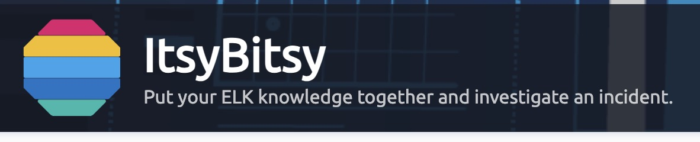
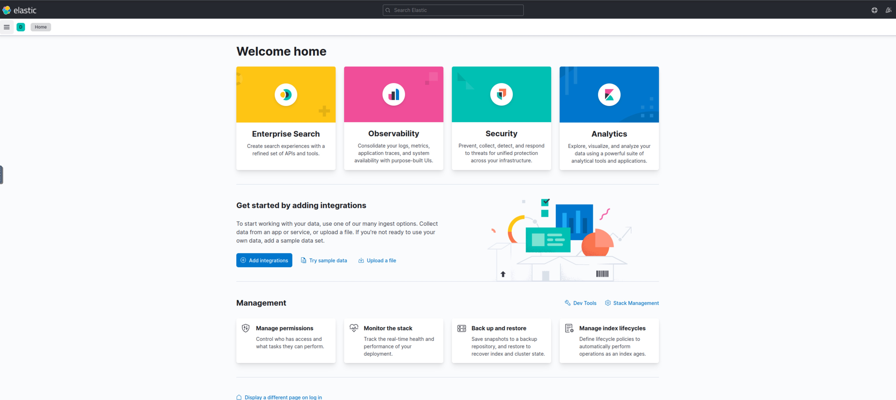
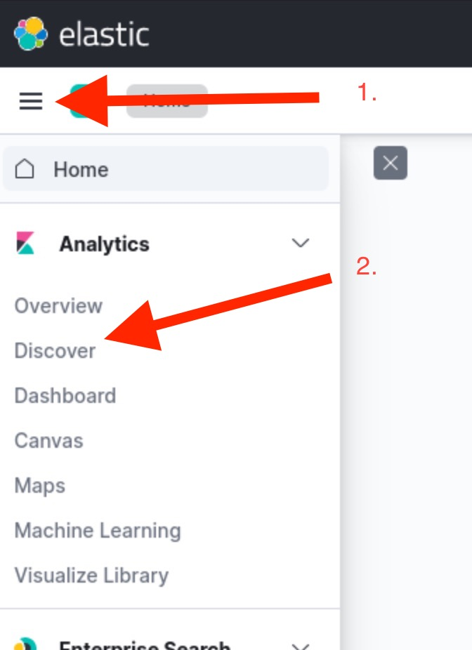
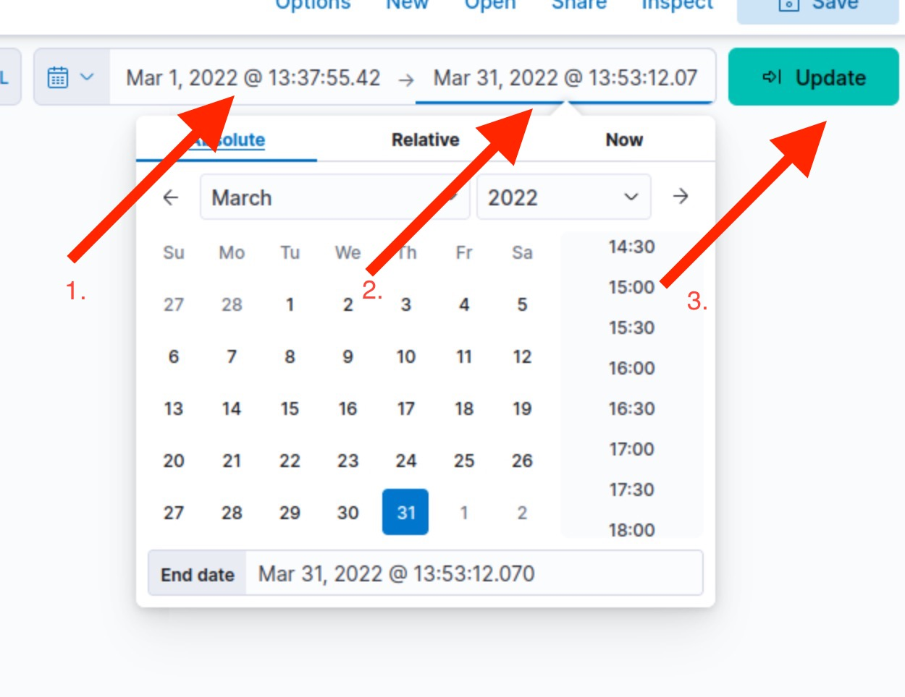
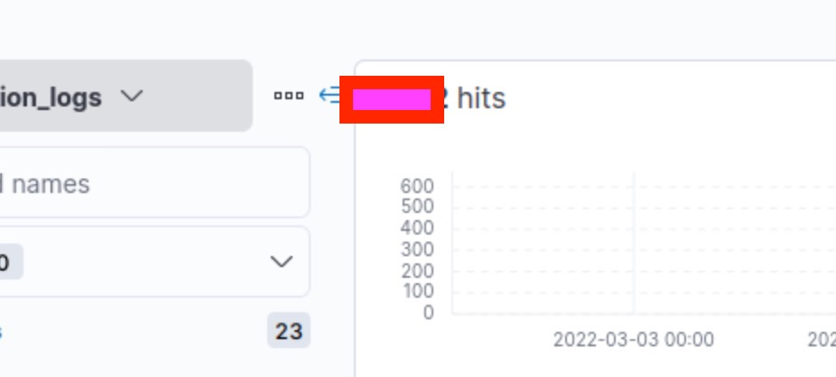
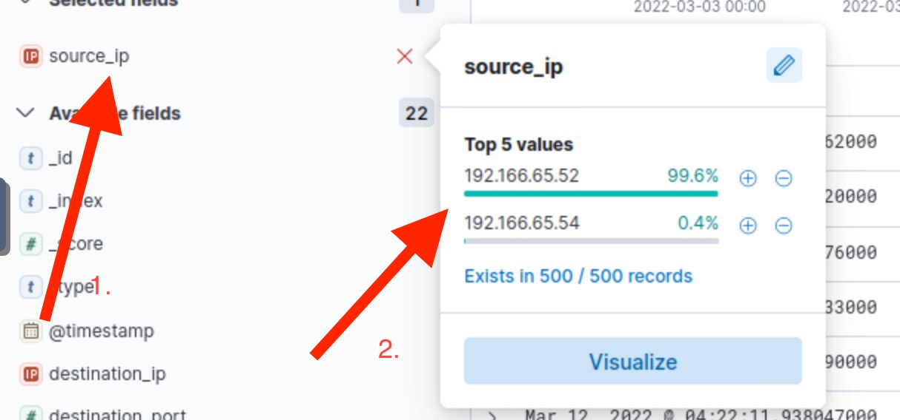
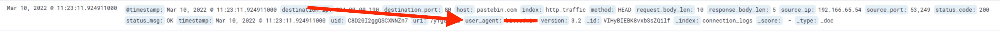
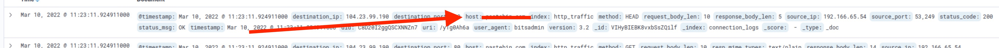
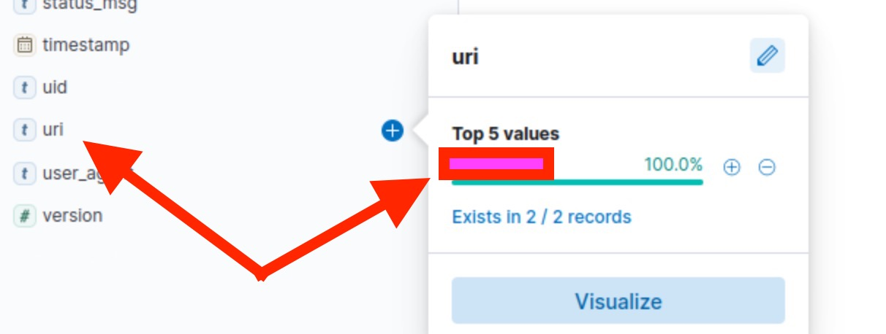
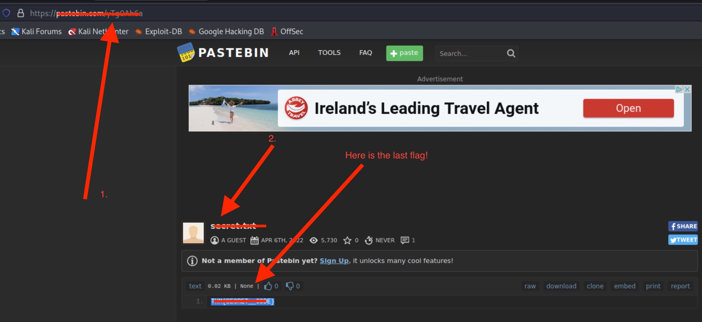

<h1>About</h1>
This is challenge to test your knowledge and investigate an incident with the help of ELK

It is advisable to have done the [Investigation with ELK 101](https://tryhackme.com/room/investigatingwithelk101) before you try this CTF.

## Start here.
The first thing you have to do is start the VM and then to connect with your VM or use the VM of THM.

When your VM starts you can input the < ip > from the Activated machine and you will be connected directly to the Elasticsearch page.

Now you can click on the top left where the 3 parallel lines are and after on the Discover tab of Analytics

On the new screen you are not going to see any results because you have to adjust the time values. The instructions asks us to use the month March 2022. So change the start and end date, then press update.

Now we can start answering questions.

## How many events were returned for the month of March 2022?

You can find the answer after the dates have been updated checking the number of hits.

## What is the IP associated with the suspected user in the logs?
Using the filter of Source_ip you can see 2 IPs just test them.

## The user’s machine used a legit windows binary to download a file from the C2 server. What is the name of the binary?

Now we will use the Source_IP to check the packages that where send out and find the user_agent.

## The infected machine connected with a famous filesharing site in this period, which also acts as a C2 server used by the malware authors to communicate. What is the name of the filesharing site?

Again using the same filter you can see the website 

## What is the full URL of the C2 to which the infected host is connected?

We can find the information again the same way, but we can also do this.
Click on the uri and you can get the answer. (tip: use the name of the site first and then the uri.)

## A file was accessed on the filesharing site. What is the name of the file accessed?

For this question we are going to use the full url we found for the previous question and visit the website.

## The file contains a secret code with the format THM{_____}.

You can see the answer at the previous picture.

<h4>Thank you for reading the walkthrough. I hope you enjoyed it and if you have any questions please feel free to email me!</h4>
