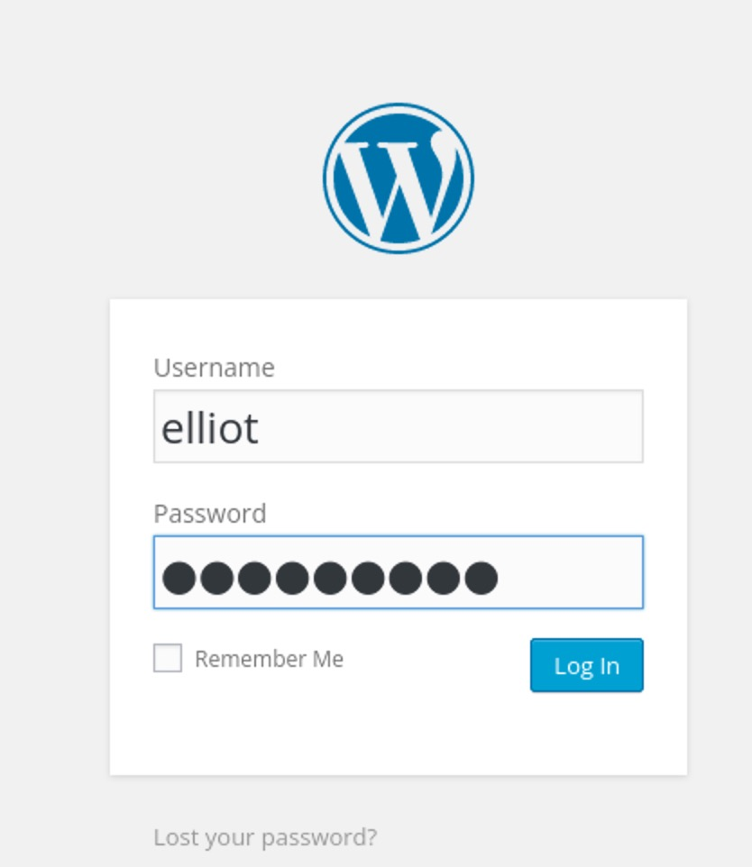
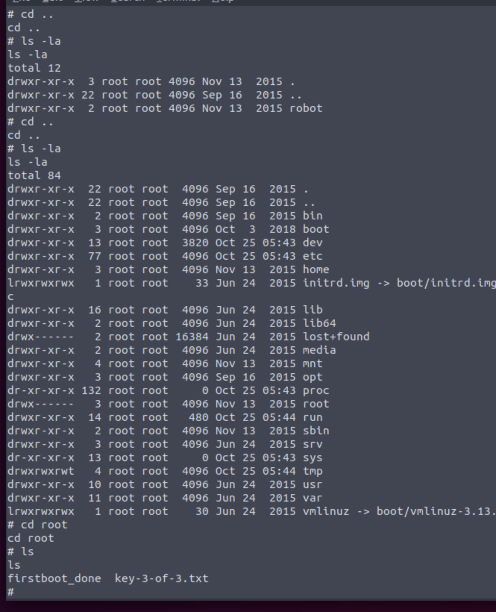

<h1>About</h1>

Welcome to another one of my walkthroughs. 

This is the write up for the Mr Robot CTF.
As always my write ups will be giving you some explanation but not all the steps/theory that you can find on the website.

# What is key 1?
*Hint: Robots*

As the hint suggest we should use robots. Let's try to remember what robots.txt is used for:

*The robots.txt file specifies which parts of a website should not be crawled by search engines and other web robots.*

As per usual we will start with nmap to check for the normal vulnerabilities. 

Nothing to write home about:

Next step is to check the ip with a Web-browser:

This look promising so lets check the source code:

Hmm We know that *We are not alone*.

So again nothing special. It is now time to use the hint *Robots*.

This is a common folder than can be found in many webpages. 

As we can see we get back 3 items.
User-agent:*
fsocity.dic
key-1-of-3.txt
I think that we got more than just the 1st flag.

We can use the `key-1-of-3.txt` in the address bar.

<h2>SUCCESS</h2>

# What is key 2?
*Hint: There's something fishy about this wordlist... Why is it so long?*

Well in the previous task we show that there was a file called `fsocity.dic`, let us try to use it in the address bar. 

We have downloaded a file! If we check the file it is a dictionary that is usually used for dictionary attacks. 

But where we make a dictionary attack? 

We can use some of the tools we have available to check for common directory names used by the server. One of the easiest tools to use is gobuster.

For this example we are going to use the command:

`gobuster dir -u <ip> -w '/usr/share/wordlists/dirbuster/directory-list-2.3-small.txt' -t 100 -q -o ~/Desktop/gobuster.txt`

<h3>Explanation></h3>

The following command indicates which wordlist gobuster is going to use. If you are using the online VM most of the wordlists are in the `/usr/share/wordlists/` directory.

`-w '/usr/share/wordlists/dirbuster/directory-list-2.3-small.txt'`

`-t 100`,  is the number of the threads. 

`-q`, is for quiet ( you will not see the error reports).

`-o`, is for the output file of the report (if you want an output file)

`~/Desktop/gobuster.txt`, the name of the output file.

This is the result of the search.

We can see a lot of  directories that are accessible (Status:200). 
Let check them!

**readme**

So apparently we are on the correct path.

**Sitemap**

Nothing special happening here!

**wp-login**

If you are not familiar with WordPress sites, the only thing you need to know is that they are susceptible to hacking. *Especially SQLinjections*
If we do not find anything else that is easier we might follow this. 

**intro**

We only get a small video playing.

Again nothing special here.

**license**

Hmmm, now we get some information. 
If we scroll down the page we get extra text.

And something interesting:

What this might be?
The `=` at the end give us a hint that it might be text encoded on base64. 
Let us try it:

It looks like a username and password. Probably it is for the WordPress login page we saw earlier. 

**Success**

 

 

While we check the Wordpress Dashboard we can se that at we have full access. Now we can easily manipulate the data of one of the pages to execute a [Reverse Shell](https://www.imperva.com/learn/application-security/reverse-shell/) for us. 

First we go to Appearance --> Editor --> and choose one of the Templates that are on the right side.

 

I chose the 404 Template, you can choose any one you like. 
The next step is to provide the code for your reverse shell. If you do a search in google the 1st return is this [Reverse Shell pentestmonkey](https://github.com/pentestmonkey/php-reverse-shell). 

You just copy - paste the php-reverse-shell.php to the 404.php template in WordPress and we are almost there.
Now we must change some of the information that are in the php-reverse-shell we pasted on the 404.php. Mainly we need to update the script with the IP address of the machine we are using to hack the website and the port that we are listening.

 

Next step is to start a net listener. For this we will use the [NetCap](https://netcap.io/) because it is fast and simple.

 

So now we should just start the listenting and call the page with `http://wp-login/404.php`
*I use different machine for this because my stupid machine can not handle incoming requests(are blocked by the VM firewall)*

And this is the result of the listening:

 

Now we can start searching inside the machine. After some digging I found this file:

 

As you can see we can not just open the file so, maybe we must use the password.raw-md5!

We can use some build in tools to check if we can crack(dictionary) the hash or use online tools like [Crackstation](https://crackstation.net/)

 

**Success**

 

The hash is a known password: `abcdefghijklmnopqrstuvwxyz`

Now we need to become a bit more technical. In order to logon as robot user, we must run a python script.

`python -c 'import pty;pty.spawn("/bin/bash")'`

Some explanation about the script:

`python -c` This part of the command tells the system to execute the following Python code directly from the command line.

`import pty` This imports the pty module, which allows the creation of pseudo-terminal pairs, making it possible to have a more interactive shell session.

`pty.spawn("/bin/bash")` This function spawns a new process (in this case, a bash shell) with pseudo-terminal support, which means the new shell will behave more like a regular interactive terminal.

`bin/bash` This part specifies that a bash shell should be started. The bash shell is a common shell used in Unix-like operating systems.

After you run this command you can run a linux shell from the reverse shell... 
Now you just need to use the `su robot` command and `cat key-2-of-3.txt` to get the second key.

<h2>Success</h2>

<h3>Second key: 822c73956184f694993bede3eb39f959</h3>

 

That was a long key to find!

# What is key 3?

The previous explanation was really extensive and this write up is taking to long, so I will sorten it a bit. 
Some times there are cases that configurations of various binaries are not correctly done and can lead to some interesting situations. One of the binaries we can find is for nmap.

You can find some more information here [GTFOBins](https://gtfobins.github.io/gtfobins/nmap/)

So we can use the command `nmap --interactive` and `!sh` to interact with the nmap and create a reverse shell.

 

As you can see we are now root user with elevated rights. We will just navigate though the file system until we can find something interesting. 

 

We managed to log in as root user in the root folder and found the text with the 3rd key.

 

<h1>Success</h1>

<h2>Third Key: 04787ddef27c3dee1ee161b21670b4e4 </h2>

Thank you for reading this write up. If you have any suggestions or remarks please feel free to contact me!
