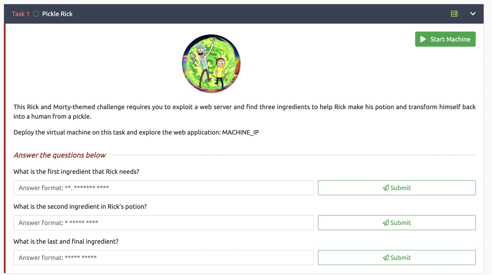
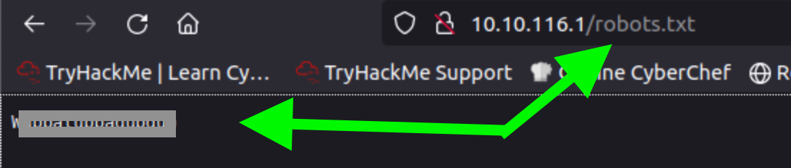

# About 
This CTF is themed around the popular Rick and Morty cartoon. 
This is my maiden attempt at writing walkthroughs, so any feedback is highly appreciated.

# Getting Started

## Step 1 

Start the VM where Rick stored the ingredients.

## Step 2 

Click Start Attack Box. You can use your personal computer, but first, connect through OpenVPN. For guidance, click on Access Machines.

For ease, use Split Screen when using the Attack Box.

## Step 3

Select View in Full Screen at the VM's bottom.

A new VM tab will appera.

## Step 4

In the original window, close the Split View by selecting it at the VM's bottom.

Use two tabs for this challenge. Dual screens make this even simpler.

Note: If you face issues after Firefox opens the VM address, switch from the AttackBox to the Kali Linux Box.

Now, let's dive into our first challenge! 

# Question 1: What is the first ingredient that Rick needs?

  

## Step 1.1
Open your preferred web browser on your machine or the VM from TryHackMe. Enter the VM's address from [Step 1](#step-1).
 

Example IP: 10.10.149.123   

Calling the IP of the VM from the browser.

## Step 1.2

Inspect the webpage's source code [Go to Source Code Inspection Help](#Source-Code-Inspection). You'll find a username, but not the password. The header also hints at more accessible directories on the server.

Username Clue

Directory Clue

## Step 1.3

Discover hidden web pages on the server using tools like [gobuster](https://www.kali.org/tools/gobuster/) or [dirbuster](https://www.kali.org/tools/dirbuster/)

Here's how to use gobuster:

- The -u option specifies the server to brute-force.
- The -w option defines the wordlist for gobuster.
- The -x option checks for specific file extensions.

The command's result:

*The directories with Status: 200 are available to see without any password...* Let us check them out before we continue.

### login.php

  We need the logins to find out more! 

### robots.txt

There is some text here, maybe this is the password for the .php login page?

### clue.txt

Here is a clue that we can use this later.

## Step 1.4
Now we are going to use the Username we found in [Step 1.2](#step-12) and the word we found on [Step 1.3](#step-13)

Success!!! 

## Step 1.5

Usually the servers are hosted by linux systems so lets try some linux commands.

Using the `ls` command in the command panel we get this response:

## Step 1.6
Using the Sup3rS3cretPickl3Ingred.txt with the IP of the VM on a web browser returns this result:

**Congratulations!!!** 
 You just found your first clue!

# Question 2 What is the second ingredient that Rick needs?

## Step 2.1
At [#Step 1.5](#step-15) we used the `ls` command, let us use the pwd and whoami commands now.

`pwd`: 

and `whoami`:

Both commands are really good to understand what are the possibilities to find more clues about the ingredients. Maybe we should start searching in the system as the [#clue.txt](#cluetxt) suggested 

## Step 2.2

Using the `ls /home command` we see that are 2 directories for users rick and ubuntu... 

## Step 2.3
Using the command `ls /home/rick` we see there is a file inside users rick directory maybe we should try to see what is inside this file with the `cat` command

## Step 2.4 
Let's try some more commands like `sudo cat /home/rick/second ingredients `

No use we must try something else.

## Step 2.5
One useful command is `sudo less` 
The only catch is that this command needs to be executed as following:
`sudo less "/home/rick/second ingredients"`
It is a bit complicated to explain what the command `less` is doing so better read the documentation.

After we run the command we have something new:

**Congratulations!!**
 You found your second ingredient!

# Question 3 What is the third ingredient that Rick needs?

## Step 3.1

Now we have to move through the directory levels with this command:  `sudo ls ../../../*`
 

 
We get  a lot of directories, if we search all of the directories we find: 

**Bingo**

If we open this file with the command `sudo less "../../../root/3rd.txt"` we get this result:

**Congratulations!! You found the last ingredient, Rick is saved!!!** 

# Source Code Inspection
For different browsers:
### Google Chrome:

1. **Right-Click Method:**
	- Right-click on a part of the webpage (avoiding any images or media).
	- Select "View Page Source" from the context menu.
1. **Keyboard Shortcut:**
	- Press `Ctrl + U` (Windows/Linux) or `Cmd + Option + U` (Mac).
1. **Menu Method:**
	 - Click on the three vertical dots (⋮) located at the top-right corner to open the Chrome menu.
	 - Navigate to "More tools" > "Developer tools", or just press `Ctrl + Shift + I` (Windows/Linux) or `Cmd + Option + I` (Mac).

### Mozilla Firefox:

1. **Right-Click Method:**
    - Right-click on a part of the webpage.
    - Select "View Page Source" from the context menu.
2. **Keyboard Shortcut:**
    - Press `Ctrl + U` (Windows/Linux) or `Cmd + U` (Mac).
3. **Menu Method:**
    - Click on the three horizontal lines (≡) located at the top-right corner to open the Firefox menu.
    - Click "Web Developer" and then "Page Source".

### Microsoft Edge:

1. **Right-Click Method:**
    - Right-click on a part of the webpage.
    - Select "View page source" from the context menu.
2. **Keyboard Shortcut:**
    - Press `Ctrl + U`.

### Safari:

1. **Menu Method:**
    - First, you need to enable the Develop menu:
        - Go to Safari > Preferences > Advanced.
        - Check the box at the bottom where it says "Show Develop menu in menu bar".
    - Once the Develop menu is enabled, you can select any page and then click "Develop" > "Show Page Source".
2. **Keyboard Shortcut:**
    - With the Develop menu enabled, you can also press `Cmd + Option + U`.
