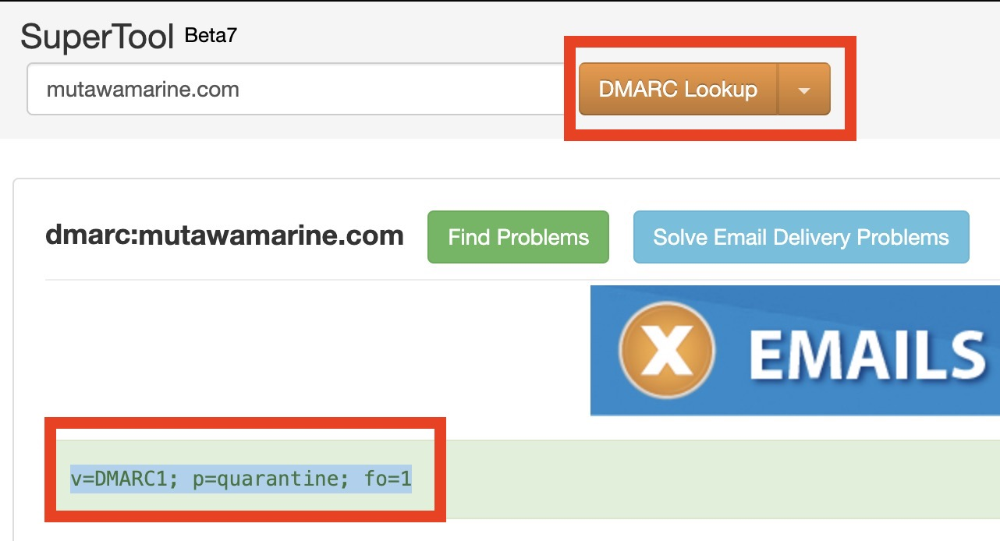

<h1>About</h1>

Welcome to another one of my walkthroughs. As per usual, I am directly showing the way to find the answers. Not the theory.

Before you start this CTF is good to have finished the rooms  [Phishing Analysis Tools](https://tryhackme.com/room/phishingemails3tryoe) and [Phishing Prevention](https://tryhackme.com/room/phishingemails4gkxh).

# Start Here

You first need to start the VM machine that is hosting Splunk and,  

if you are using the VM that are provided by TryHackMe.

Also for your own convenience you can use a separate tab for the AttackBox by doing the following:

1. Click on the View in full screen at the bottom left of the AttackBox screen.

2. Now a new tab will open with the VM and you can close the split screen by clicking on exit split view. You now have 2 tabs one with the questions and one with the VM.
    

# Questions.
## 1. What date was the email received? (answer format: M/DD/YY)
We will use the easy way for the questions that are not really technical. No need to get crazy, yet.

## 2. Who is the email from?

## 3. What is his email address?

## 4. What email address will receive a reply to this email? 

## 5. What is the Originating IP?

Now we can get a bit more deep in the technicalities of the E-Mails.

We also get a Tip: *The answer is NOT in X-Originating-Ip*

Now we will have to open the source code of the email:

View --> Message Source.

When you open the email source you will see some of the normal information you will expect to be there but as the tip mentioned it is not there. You have to scroll down to the *Content analysis details*

There you can see the 1st rule name found out that the sender is listed in https://www.dnswl.org/ and with *no trust*

There we can find his original IP: 192.119.71.157.

## 6. Who is the owner of the Originating IP? 

Again we get a Tip: *Perform a WHOIS lookup for the name of the organization*

Using the IP from the previous question (The VM is not connected to Internet so you have to do it on your own machine), we get the response we are looking for with the name of the Organization.

## 7. What is the SPF record for the Return-Path domain?

No we are really going deeper into analysis. 

***Quick explanation from our friend chatGPT what is SPF:** SPF (Sender Policy Framework) is a DNS text entry which shows a list of servers that should be considered allowed to send mail for a specific domain. Essentially, the owners of a domain can specify which mail servers they use and therefore are authorized to send mail on their behalf. It is used to prevent spam and phishing attacks by verifying the sender's IP address*

So we ust find the return path of the email we received. Again in the source code of the email we can find this information thats on the top.

But this is not the answer, now we need to check in an online tool like [MX Lookup](https://mxtoolbox.com/) for the information we need.

First you need to choose the appropriate tool to use. In our case SPF Record Lookup then you will get the answer.

## 8. What is the DMARC record for the Return-Path domain?

Again using the same tool, we will find the answer. The only thing we have to do is change the mode to DMARC.

## 9. What is the name of the attachment?

Just check at the bottom of the email.

## 10. What is the SHA256 hash of the file attachment?

You will have to save the attachment on the VM and then find the hash of the file.

## 11. What is the attachments file size? 

There is a tip here: *Don't go by the Linux file properties. Obtain the file hash and use an Open Source resource to help you with this.*

So we will use the hash and [VirusTotal](https://www.virustotal.com/gui/home/upload)

## 12. What is the actual file extension of the attachment?

We can find the answer at the details page of the search we did on VirusTotal

<h1>Congratulations you have done it!</h1>

If you have any comments please feel free to contact me!

G. Kachrimanis