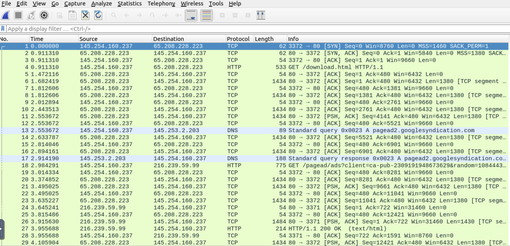
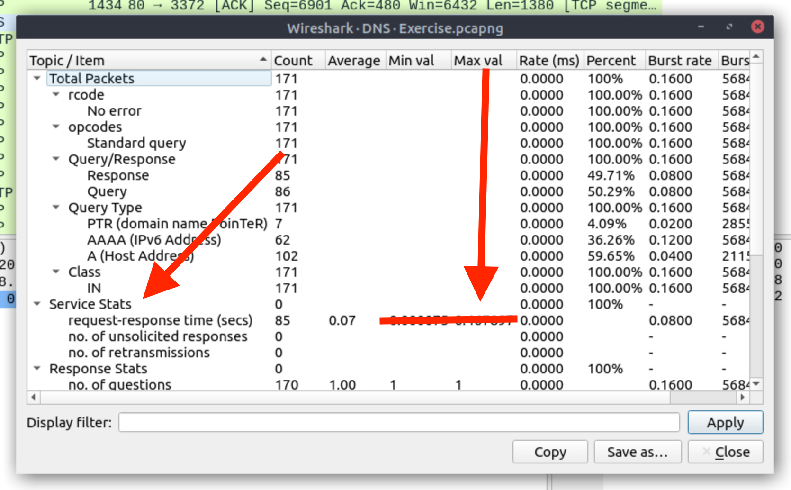

# About

This is a guide for [Wireshark: Packet Operations room in TryHackMe](https://tryhackme.com/room/wiresharkpacketoperations). The room is visible by free users but is only really usable by subscribers (you will have to use the VM in order to complete it).
Also, I strongly suggest to finish the first room [Wireshark: The Basics](https://tryhackme.com/room/wiresharkthebasics)

# General Info

There are a lot of build in filters that are really helpful in all situations using Wireshark. For example one of the most useful is Name Resolution.

Lets see one example:

On this pcap file you can see the Source and Destination IPs as numbers. 
Using the Resolve Network Address filter  
(View->Name Resolution -> Resolve Network Address)  
we can see that some of the IPs are transformed and show us the Domain name.

Now if you use the Resolve Transport Address (View->Name Resolution -> Resolve Transport Address) we can see extra information in the info about ports etc. 

**As I mentioned these filters are really useful and try to remember them in general especially if you are planing to try some Wireshark CTF**

# Task 1 Introduction
You just need to click Start Machine 

Also, after this click on Show Split View

This will split your screen in half.  

If you are lucky and have a big monitor this is not a problem. If you are using a smaller monitor or laptop then the best thing you can do is to go at the bottom of the VM part of the screen and press the View in full screen button.

After that a new browser tab will open with only the VM showing

Now you can go back at the tab with the split screen and close the VM on this tab. 

Now you will have two tabs one with the questions/examples and one tab with the VM you are going to use for the testing / answering.

# Task 2 Statistics | Summary

In this task we going to learn about the Statistics tab and the useful tools that are available to us. During the explanation you can see the tips of how to use the statistics tab. I will not explain any of these the author of this room does a much better job than me. So lets jump directly to the questions of this Task.  In total there are 5 questions.  
*I hope you can understand that I am not going to tell you how you can run Wireshark or how to open a file* 

## Question 1  
**Investigate the resolved addresses. What is the IP address of the hostname starts with "bbc"?**

Using the built in tools that this room wants to teach us we should do the following: 
1. Statistics --> Resolved addresses. 
    
2. You click on the drop down menu of "All entries", and you choose "Host". 

     
3. Then on the search entry you type "bbc" and then you will get the hostname that starts with bbc.     
     

## Question 2
**What is the number of IPv4 conversations?**

Using the built in tools that this room wants to teach us we should do the following: 
1. Statistics --> Conversations. On the window that will pop-up you can see the total amount of connections: 
    

## Question 3
**How many bytes (k) were transferred from the "Micro-St" MAC address?**

Using the built in tools that this room wants to teach us we should do the following: 
1. Statistics --> Endpoints.
2. Stay on the Ethernet tab.
3. Click on the Name Resolution.
4. You can now see the answer to the question.

## Question 4
**What is the number of IP addresses linked with "Kansas City"?**

Using the built in tools that this room wants to teach us we should do the following: 
1. Statistics --> Endpoints.
2. Open the IPv4 Tab.
3. You can now count the Endpoint connections originating from Kansas City.

## Question 5
**Which IP address is linked with "Blicnet" AS Organization?**

Using the built in tools that this room wants to teach us we should do the following: 
1. Statistics --> Endpoints.
2. Open the IPv4 Tab.
3. Click on the AS Number so the list will be Alphabetically sorted based on the As Company names. Search for Blicnet.

# Task 3 Statistics | Protocol Details

## Question 1
**What is the most used IPv4 destination address?**

Using the built in tools that this room wants to teach us we should do the following: 

1. Statistics --> IPv4 Statistics --> Destination and Port

    
2. Then on the popup window click on count to sort the list. The IP will be on top.

    

## Question 2
**What is the max service request-response time of the DNS packets?**

Using the built in tools that this room wants to teach us we should do the following: 

1. Statistics --> DNS 
2. On the popup window find Service Stats and the next line is request-response time(secs). IF you check the tabs on top you will see a Max Val tab. This is what you need. 
    
    

## Question 3
**What is the number of HTTP Requests accomplished by "rad[.]msn[.]com?**

Using the built in tools that this room wants to teach us we should do the following: 

1. Statistics --> HTTP --> Requests
   
    
2. On the popup window find the rad.msn.com and check the count. 
    
    
3. In case you cannot see the count on the top tab use the scroll bar at the bottom of the window.
    

# Task 4 Packet Filtering | Principles

Now we are going into more exciting and difficult concepts!
Although for this task we only need to read!

# Task 5 Packet Filtering | Protocols

## Question 1
**What is the number of IP packets?**

Now we are going to use the filtering system of Wireshark. There are 2 ways to do it. 

1. We type in the filter we want to use. For this example is the `ip` or `ip.proto`. Then we can see at the bottom right of the page displaying the *Packets* (Total packets in the file we are examining) and the *Displayed* (The amount of packets that are found by our filter) 
    
    
2. We can use the GUI to fill in the command for us.  
    a. Analyze --> Display Filter Expression. 
    b. Then search through then you can search through the long list and choose the appropriate protocol you need. This is taking usually more time consuming so in general for commands we are familiar with we should type directly to the filter. ( I am not going to provide pictures about this method as it is really tedious to go through list with all the filters.)    
## Question 2
**What is the number of packets with a "TTL value less than 10"?**

Again this is a really simple search. We can sue the filter `ip.ttl < 10 ` or `ip.ttl lt 10` ( *TTL: time to live -How many hopes the packet can do before it is dropped- and lt: less than*). 
Again you can find the total amount on the bottom right of the screen at the *Displayed Packets* 

## Question 3
**What is the number of packets which uses "TCP port 4444"?**

For this search we use the filter `tcp==4444` that's it. Again you can find the total amount on the bottom right of the screen at the *Displayed Packets* 

## Question 4
**What is the number of "HTTP GET" requests sent to port "80"?**
Now this is a more advanced filter because we have to use 2 commands.
One is the HTTP GET request  `http.request.method == "GET"` and the other, sent to port 80 `tcp.dstport == 80`. Now we should use one of the logical expressions for *and* `&&` or `and`.  So the filter should be `http.request.method == "GET" && tcp.dstport == 80` or 
`http.request.method == "GET" and tcp.dstport == 80`

Again you can find the total amount on the bottom right of the screen at the *Displayed Packets* 

## Question 5
**What is the number of "type A DNS Queries"?**

Again a simple filter to apply. We can use the command `dns.a`.

Again you can find the total amount on the bottom right of the screen at the *Displayed Packets* 

# Task 6 Advanced Filtering

## Question 1
**Find all Microsoft IIS servers. What is the number of packets that did not originate from "port 80"?**
Now again we have to use a combination of commands in order to filter the packages we are looking.
So to find all Microsoft IIS servers we will use `http.server contains "Microsoft-IIS"` and for not originate from port 80 `!(tcp.srcport==80)`. *We can also use the old style `tcp.srcport != 80`* 
Combining the 2 commands we have `http.server contains "Microsoft-IIS" && !(tcp.srcport==80)`.

Again you can find the total amount on the bottom right of the screen at the *Displayed Packets* 

## Question 2
**Find all Microsoft IIS servers. What is the number of packets that have "version 7.5"?**

For this filter you can use the command that the Hint suggests `http.server matches "Microsoft-IIS/7.5"` or `http.server contains "Microsoft-IIS/7.5"`

Again you can find the total amount on the bottom right of the screen at the *Displayed Packets* 

## Question 3
**What is the total number of packets that use ports 3333, 4444 or 9999?**

Simple question. We are just using exactly as the example for 'in' `tcp.port in {3333, 4444, 9999}` 

Again you can find the total amount on the bottom right of the screen at the *Displayed Packets* 

## Question 4
**What is the number of packets with "even TTL numbers"?**

Just as the hint asks us to do. `string(ip.ttl) matches "[02468]$"`.

Again you can find the total amount on the bottom right of the screen at the *Displayed Packets* 

## Question 5
**Change the profile to "Checksum Control". What is the number of "Bad TCP Checksum" packets?**

So now we must use the GUI again for this one.
1. Edit --> Configuration Profiles,  and chose *Checksum Control*.

    
2. Now you have to find the bad packets so `tcp.checksum_bad.expert`.
    

Again you can find the total amount on the bottom right of the screen at the *Displayed Packets* 

## Question 6
**Use the existing filtering button to filter the traffic. What is the number of displayed packets?**

So this is not so hard but it needs to be familiar with Wireshark
You right click on the top right corner of wireshark (gif/jpeg with http-200).

 Then Apply as Filter --> Selected. A new filter will be applied. `(http.response.code == 200 ) && (http.content_type matches "image(gif||jpeg)")   

Again you can find the total amount on the bottom right of the screen at the *Displayed Packets* 

<h1>That's all folk's I hope you enjoyed this walk through.  