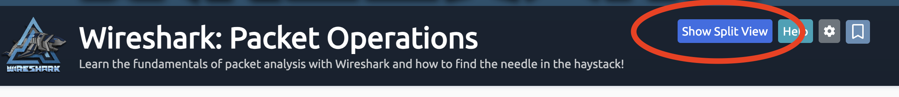

# About

This is a guide for [Wireshark: Packet Operations room in TryHackMe](https://tryhackme.com/room/wiresharkpacketoperations). The room is visible by free users but is only really usable by subscribers (you will have to use the VM in order to complete it).
Also, I strongly suggest to finish the first room [Wireshark: The Basics](https://tryhackme.com/room/wiresharkthebasics)

# General Info

There are a lot of build in filters that are really helpful in all situations using Wireshark. For example one of the most useful is Name Resolution.

Lets see one example:

On this pcap file you can see the Source and Destination IPs as numbers. 
Using the Resolve Network Address filter  
(View->Name Resolution -> Resolve Network Address)  
we can see that some of the IPs are transformed and show us the Domain name.

Now if you use the Resolve Transport Address (View->Name Resolution -> Resolve Transport Address) we can see extra information in the info about ports etc. 

**As I mentioned these filters are really useful and try to remember them in general especially if you are planing to try some Wireshark CTF**

# Task 1 
You just need to click Start Machine 

Also, after this click on Show Split View

This will split your screen in half.  

If you are lucky and have a big monitor this is not a problem. If you are using a smaller monitor or laptop then the best thing you can do is to go at the bottom of the VM part of the screen and press the View in full screen button.

After that a new browser tab will open with only the VM showing

Now you can go back at the tab with the split screen and close the VM on this tab. 

Now you will have two tabs one with the questions/examples and one tab with the VM you are going to use for the testing / answering.

# Task 2
